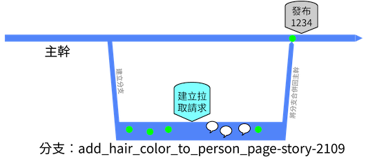
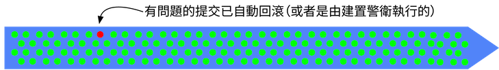

## Distance


&mdash; Frank Compagner, Guerrilla Games


Assuming any network-accessible source control, physical distance is mitigated by AV technologies including 
screen sharing. So we will not worry about that so much these days.

Frank's 'distance' is about the distance to the integration of code from multiple components/modules/sub-teams for a 
binary that could be deployed or shipped. The problematic distance is to code not yet in the single shared branch, 
that might:

* break something unexpected once merged
* be difficult to merge in.
* not show that work was duplicated until it is merged
* not show problems of incompatibility/undesirability that does not break the build

Trunk-Based Development is a branching model that reduces this distance to the minimum. 
 
## What it is


* Use of "Developers" throughout this site, means "QA-automators" for the same buildable thing, too.
* When we say 'the trunk' on this site, it is just a branch in a single repository that developers in a team are focusing on 
for development. It may be called 'main'. That hints at the fact that the branch in question may literally not be 
called 'trunk' at all.


There are many deciding factors before a development team settles on Trunk-Based Development, but here is a short overview 
of the practices if they do:

### Releasability of work in progress

Trunk-Based Development will always be **release ready**

If an executive manager visited the development team and commanded "Competitor X has launched feature Y, go 
live now with what we have", the worst response would be "give us one hour". The development team might have been very 
busy with tricky or even time-consuming tasks (therefore partially complete), but in an hour, they are able to go live 
with something just stabilized from the trunk. Perhaps they can do it in less than an hour. The rule, though, is to **never break 
the build**, and **always be release ready** because the CIO or the business may surprise you.

#### Where releases happen

A key facilitating rule is that Trunk-Based Development teams exclusively **either** release directly from the 
trunk - see [release from trunk](/release-from-trunk/), **or** they make a branch from the trunk specifically for 
the actual release. See [Branch for release](/branch-for-release/).
Teams with a higher release cadence do the former, and those with a lower release cadence do the latter. 

### Checking out / cloning

All developers in a team working on an application/service, clone and checkout from the trunk. They will 
update/pull/sync from that branch many times a day, **knowing** that the build passes. Their fast 
source-control system means that their delays are a matter of a few seconds for this operation. They are now 
integrating their teammates' commits on an hour-by-hour basis.

### Committing

Similarly, developers completing a piece of development work (changes to source code), that does not 
break the build, will commit it back to the trunk. That it does not break the build should be provable. The granularity of that commit (how many a developer 
would implicitly do a day) can vary and is learned through experience, but commits are typically small.

The developer needs to run the build, to prove that they did not break anything with the commit **before** the commit
is pushed anywhere. They might have to do an update/pull/sync before they commit/push the changes back to the team's 
version control server, and additional builds too. There's a risk of a race condition there, but let us assume that is not 
going to happen for most teams.

### Code Reviews

The developer needs to get the commit reviewed. Some teams will count the fact that the code was 'pair programmed' 
as an automatic review. Other teams will follow a conventional design where the commit is marshaled
for review before landing in the trunk. In modern portal solutions, marshaled nearly always means a branch/fork (Pull
Request) that is visible to the team.

([key](/key/))

^ the speech bubbles are stylized code review comments

Code review branches can (and should) be 
deleted after the code review is complete and be very short-lived. This is tricky for teams new to Trunk Based 
Development. 

Note: You want to keep 
the commentary/approval/rejection that is part of the review for historical and auditing purposes, but you do not want to 
keep the branch. Specifically, you do not want the developers to focus on the branch after the code review and merge back
to the trunk.

## A safety net

[Continuous Integration](/continuous-integration/) (CI) daemons are set up to watch the trunk (and the 
[short-lived feature branches](/short-lived-feature-branches/) used in review), and as quickly and completely as possible 
loudly/visibly inform the team that the trunk is broken.  Some teams will lock the trunk and roll-back changes. Others 
will allow the CI server to do that automatically.

([key](/key/))

The high bar is verifying the commit before it lands in the trunk. Short-lived Pull Request branches are the modern
place for that.
 
## Developer team commitments

As stated, developers are pledging to be rigorous and not break the build. They're also going to need to consider 
the impact of their potentially larger commits, especially where renames or moves were wholesale, and adopt techniques
to allow those changes to be more easily consumed by teammates.

## Drilling into 'Distance'

Problematic 'distance' has a few tangible examples:

* Late merges of development that happened more than a couple of days ago
  * Difficult merges in particular
* A breaking build that lowers development team throughput, and diverts resources while it is being fixed

# References elsewhere

<a id="showHideRefs" href="javascript:toggleRefs();">show references</a>

    <table style="border: 0; box-shadow: none">
        <tr>
            <td style="padding: 2px" valign="top">03 Sep 2009, MartinFowler.com article</td>
        </tr>
        <tr>
            <td style="border-top: 0px; padding: 2px" valign="top"><a href="https://martinfowler.com/bliki/FeatureBranch.html">FeatureBranch</a></td>
        </tr>
    </table>
    <table style="border: 0; box-shadow: none">
        <tr>
            <td style="padding: 2px" valign="top">16 Jun 2015, Blog Entry</td>
        </tr>
        <tr>
            <td style="border-top: 0px; padding: 2px" valign="top"><a href="http://www.alwaysagileconsulting.com/articles/organisation-pattern-trunk-based-development">Organization Pattern: Trunk-Based Development</a></td>
        </tr>
    </table>
    <table style="border: 0; box-shadow: none">
        <tr>
            <td style="padding: 2px" valign="top">04 Oct 2016, Blog Entry</td>
        </tr>
        <tr>
            <td style="border-top: 0px; padding: 2px" valign="top"><a href="https://www.michielrook.nl/2016/10/branches-considered-harmful/">Branches considered harmful</a></td>
        </tr>
    </table>

