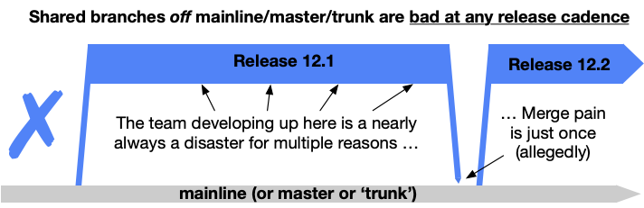
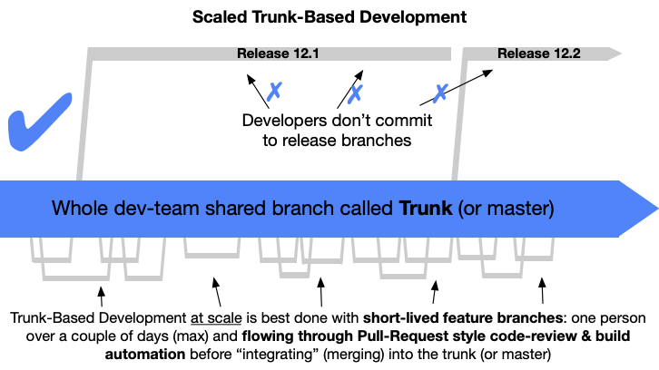
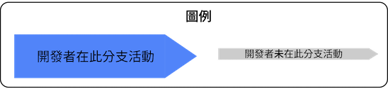

<!--
## One line summary

A source-control branching model, where developers collaborate on code in a single branch called 'trunk' *,
resist any pressure to create other long-lived development branches by employing documented techniques. They
therefore avoid merge hell, do not break the build, and live happily ever after.
-->

## 一行總結

主幹開發是一種程式碼分支管理模型，開發者在一個稱為「主幹」的分支上共同工作，透過採用規範好的技術手段，來抵抗因為長期存在的開發分支所導致的開發壓力。此舉可以避免分支合併的難題，確保不會破壞版本建置，並持續保持一個隨時可部署的穩定版本。

<!--
 &ast; *main* for the Git community since 2020 (`master` with unsavory connotations before)
-->

&ast; 自 2020 年起，Git 社群改用 *main* 作為主要分支（在此之前使用 `master`，但帶有不良含義）

<!--
## Shared branches off mainline/main/trunk are bad at any release cadence:

-->

## 在任何發布節奏下，從主幹上建立出共享分支都是不好的：

<!--
## Trunk-Based Development For Smaller Teams:

-->

## 小型團隊的主幹開發：

<!--
## Scaled Trunk-Based Development:

-->

## 大型團隊的主幹開發：

<!--
## Elaboration, Claims and Caveats

-->

## 闡述、主張與注意事項

<!--
Trunk-Based Development is a key enabler of [Continuous Integration](/continuous-integration/) and by extension
[Continuous Delivery](/continuous-delivery/). When individuals on a team are committing their changes to the trunk
multiple times a day it becomes easy to satisfy the core requirement of Continuous Integration that all team
members commit to trunk at least once every 24 hours. This ensures the codebase is always releasable on demand
and helps to make Continuous Delivery a reality.
-->

主幹開發是實現[持續整合](/continuous-integration/)以及進一步實現[持續交付](/continuous-delivery/)的關鍵推動者。當團隊中的成員每天多次將他們的變更提交到主幹時，就能輕易滿足持續整合的核心要求，即所有團隊成員每 24 小時至少向主幹提交一次。這確保了基準程式碼隨時可以按需求發布，並有助於實現持續交付。

<!--
The dividing line between small team Trunk-Based Development and scaled Trunk-Based Development is a subject to team size and commit rate consideration. The precise moment a dev team is no longer "small" and has transitioned to "scaled" is subject to practitioner debate.  Regardless, teams perform a full "pre integrate" build (compile, unit tests, integration tests) on their dev workstations before committing/pushing for others (or bots) to see.
-->

小型團隊的主幹開發與大型團隊的主幹開發之間的劃分，取決於團隊大小和提交頻率的考量。一個開發團隊何時不再被視為「小型」並已轉變為「大型」，這是實踐者們的討論主題。無論如何，團隊在提交或推送給其他人（或機器人）查看之前，會在他們的開發個人電腦上進行完整的「預整合」建置（編譯、單元測試、整合測試）。

<!--
### Claims

- You should do Trunk-Based Development instead of GitFlow and other branching models that feature multiple long-running branches
- You can either do a direct to trunk commit/push (v small teams) or a Pull-Request workflow as long as those feature branches
  are short-lived and the product of a single person.
-->

### 主張

- 你應該進行主幹開發，而不是 GitFlow 和其他具有多個長期運行分支的分支模型
- 你可以直接進行主幹的提交或推送（適用於非常小的團隊），或者進行拉取請求的工作流程，只要那些功能分支的生命週期短暫，並且是單一人員的產出。

<!--
### Caveats
-->

### 注意事項

<!--
- Depending on the team size, and the rate of commits,
  [short-lived feature branches](/short-lived-feature-branches/) are used for
  code-review and build checking (CI), but not artifact creation or publication, to happen before commits land in the trunk for other developers to depend on.
  Such branches allow developers to engage in [eager and continuous code review](/continuous-review/) of contributions
  before their code is integrated into the trunk. Very small teams may [commit direct to the trunk](/committing-straight-to-the-trunk/).
-->
- 根據團隊大小和提交速率的不同，[短期功能分支](/short-lived-feature-branches/)用於程式碼審查和建置檢查（持續整合），但不用於產生或發布產品，這些操作在提交到主幹之前進行，以供其他開發者依賴。這樣的分支允許開發者在將其程式碼整合到主幹之前進行[積極且持續的程式碼審查](/continuous-review/)。非常小的團隊可能會[直接提交到主幹](/committing-straight-to-the-trunk/)。

<!--
- Depending on the intended release cadence, there may be [release branches](/branch-for-release/) that are cut from the trunk on
  a just-in-time basis, are 'hardened' before a release (without that being a team activity), and **those branches are deleted** some time after release. Alternatively, there
  may also be no release branches if the team is [releasing from Trunk](/release-from-trunk/), and choosing a "fix
  forward" strategy for bug fixes. Releasing from trunk is also for high-throughput teams, too.
-->
- 根據預定的發布節奏，團隊或許需要即時的從主幹中切分出[發布分支](/branch-for-release/)，在發布之前將版本「固化（hardened）」，避免團隊有新的活動讓發布版本異動，並在發布後的某個時間點刪除這些分支。或者，如果團隊從主幹進行發布並選擇「立即修正（fix forward）」策略來進行錯誤修復，則可能不會有發布分支。從主幹進行發布也適用於高產能團隊。

<!--
- Teams should become adept with the related [branch by abstraction](/branch-by-abstraction/) technique for longer
  to achieve changes, and use [feature flags](/feature-flags/) in day to day development to allow for hedging on
  the order of releases (and other good things - see [concurrent development of consecutive releases](/concurrent-development-of-consecutive-releases/))
-->

- 團隊應該熟練掌握相關的[抽象分支](/branch-by-abstraction/)技術，以實現更長期的變更，並在日常開發中使用[功能標誌](/feature-flags/)來允許針對發布順序進行避險（以及其他好處——請參閱[連續發布的並行開發](/concurrent-development-of-consecutive-releases/)）。

<!--
- If you have more than a couple of developers on the project, you are going to need to hook up a
  [build server](/continuous-integration/) to verify that their commits have **not broken the build**
  after they land in the trunk, and also when they are ready to be merged back into the trunk from a
  short-lived feature branch.
-->

- 如果你的專案有多位開發者，你需要連接一個[建置伺服器](/continuous-integration/)來驗證他們的提交在進入主幹後是否**沒有破壞建置**，同時也要在他們從短期功能分支合併回主幹時進行驗證。

<!--
- Development teams can casually flex up or down in size (in the trunk) without affecting throughput or quality.
  Proof? [Google does Trunk-Based Development](/game-changers/index.html#google-revealing-their-monorepo-trunk-2016) and
  have **35000 developers and QA automators** in that single [monorepo](/monorepos/) trunk, that in their case can
  [expand or contract](/expanding-contracting-monorepos/) to suit the developer in question.
-->

- 開發團隊可以隨意調整大小（在主幹中），而不會影響生產力或品質。如果想了解證據，可以參考 [Google 實行主幹開發](/game-changers/index.html#google-revealing-their-monorepo-trunk-2016)，他們的[單一版本庫](/monorepos/)的主幹中擁有 **35000 名開發者和 QA 自動化測試人員**，該主幹可以根據開發者的需求[擴大或縮小](/expanding-contracting-monorepos/)。

<!--
- People who practice the [GitHub-flow branching model](/alternative-branching-models/index.html#modern-claimed-high-throughput-branching-models) will feel
  that this is quite similar, but there is one small difference around where to release from.
-->

- 實踐 [GitHub Flow 分支模型](/alternative-branching-models/index.html#modern-claimed-high-throughput-branching-models) 的人會覺得這很相似，但在發布的位置上有一個小差異。

<!--
- People who practice the Gitflow branching model will find this **very different**, as will many developers used to
  the popular ClearCase, Subversion, Perforce, StarTeam, VCS [branching models of the past](/alternative-branching-models/index.html#legacy-branching-models).
-->

- 使用 Gitflow 分支模型的人會發現這**非常不同**，同樣的情況也適用於許多習慣於流行的 ClearCase、Subversion、Perforce、StarTeam、VCS [過去的分支模型](/alternative-branching-models/index.html#legacy-branching-models)的開發者。

<!--
- [Many publications](/publications/) promote Trunk-Based Development as we describe it here. Those include the best-selling 'Continuous Delivery' and 'DevOps Handbook'. This should not even be controversial anymore!
-->

- [許多出版物](/publications/)推廣我們在這裡描述的主幹開發。其中包括暢銷書《Continuous Delivery》和《DevOps Handbook》。這個觀點現在甚至不應該再有爭議！

<!--
## History
-->

## 歷史

<!--
Trunk-Based Development is not a new branching model. The word 'trunk' is referent to the concept of a growing tree,
where the fattest and longest span is the trunk, not the branches that radiate from it and are of more limited length.

It has been a lesser known branching model of choice since the mid-nineties and considered tactically since the eighties.
The largest of development organizations, like Google (as mentioned) and Facebook practice it at scale.
-->

自從九十年代中期以來，它一直是一種較少為人知的分支模型選擇，並自八十年代以來被戰略性地考慮。像 Google（如前所述）和 Facebook 這樣的大型開發組織都在大規模地實踐主幹開發。

<!--
Over 30 years different [advances to source-control technologies and related tools/techniques](/game-changers/) have made
Trunk-Based Development more (and occasionally less) prevalent, but it has been a branching model that many have stuck
with through the years.
-->

超過 30 年來，不同的[程式碼版本控制技術和相關工具與技術的進步](/game-changers/)使得主幹開發變得更為（偶爾也會少些）普遍，但這麼多年來，還是有很多人堅持使用主幹開發分支模型。

<!--
## This site

This site attempts to collect all the related facts, rationale and techniques for Trunk-Based Development together
in one place, complete with twenty-five diagrams to help explain things. All without using TBD as an acronym
even ~~once~~ twice.
-->

## 關於本站

本站試圖將所有主幹開發相關的事實、原因及技巧彙整在同一處，並提供二十五張圖表輔助說明各項內容。全站一次也沒有使用過 TBD 這一縮寫——不，連兩次都沒有。
