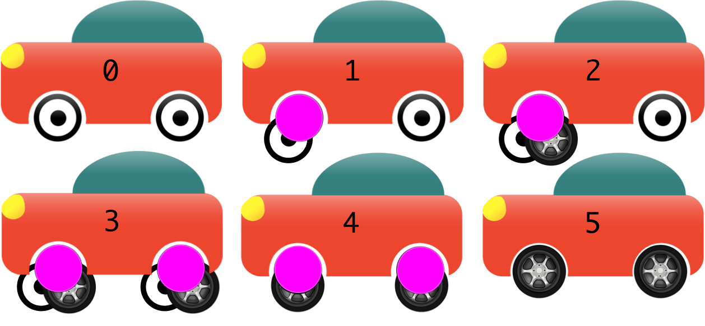

<!--
Branch by Abstraction is a set-piece technique to effect a 'longer to complete' change in the trunk. Say a developer
(or a pair of developers), has a change that is going to take five days to complete. There could easily be pressure to
create a branch for this - somewhere that can be unstable for a period of time before it completes (and gets merged
back somewhere).

There may be some aspect of repetition to the coding activities that makes it longer to complete. No matter, the 
change was predicted as being time-consuming, complex, destabilizing/disruptive to everyone else in the development team.

**Rules:**
 
1. There are also a lot of developers already depending on 
the code that is subject of the 'longer to complete' change, and we do not want them to be slowed down in any way.
2. No commit pushed to the shared repository should jeopardize the ability to go live.
-->

抽象分支是一種技巧，用於在主幹上實現那些完成時間較長的更改。舉例來說，假設一位開發者（或實行配對開發的一對開發者）面臨一項工作，預計需要五天才能完成時，常常會面臨是否應該為此建立一個分支的壓力。這樣的分支可以在完成之前一段時間內處於不穩定狀態（直到最終被合併回某處）。

使用這種方法可能是因為開發過程中存在重複性質的工作，這讓工作變得更加耗時。不管具體原因是什麼，這樣的變更被認為是耗時且複雜的，並且可能對開發團隊中其他成員造成不穩定或干擾。

**規則︰**

1. 對於那些正在進行的、需要較長時間才能完成的程式碼變更，已有許多開發者依賴於這部分程式碼。重要的是，這些進行長期更改的工作不應該影響到其他開發者的工作效率和進度。
2. 任何時候，向共享程式碼版本庫中推送的提交都必須保證不會影響到產品的上線能力。

<!--
## Ideal steps

For simplicity's sake, let us say there is code that is 'to be replaced', code 'to be introduced'.

1. Introduce an abstraction around the code that is to be replaced, and commit that for all to see.  If needed, this 
can take multiple commits. None of those are allowed to break the build, and all of them could be pushed to the shared
repository in order, and as done.
2. Write a second implementation of the abstraction for the to-be-introduced code, and commit that, but maybe as 
'turned off' within the trunk so that other developers are not depending on it yet. If needed, this can take multiple 
commits as above. The abstraction from #1 may also be occasionally tweaked, but must follow the same rule - do not 
break the build.
3. Flip the software 'off' switch to 'on' for the rest of the team, and commit/push that.
4. Remove the to-be-replaced implementation
5. Remove the abstraction

Hopefully, your team uses an IDE that can perform complex refactorings on sets on checkouts, in a way that running the build 
after each is an uneventful validation of the refactorings.
-->

## 理想的步驟

為了簡化說明，我們假設有一部份程式碼是需要被替換的，另一部份程式碼是將要被引入的。

1. 引入抽象，在那些即將被替換的程式碼周圍引入一個抽象層，並提交這個變更，讓團隊成員都能看到。如果必要的話，這一步可能需要分成多次提交來完成。重要的是，這些提交都必須是完成且可以運行的，不能破壞建置過程，並且可以被依次推送到共享程式碼版本庫中。
2. 實現抽象，針對將要引入的程式碼，寫一個該抽象層的第二個實現，並提交它。初期，這部分新程式碼的執行可能在主幹中被「關閉」，以避免其他開發者依賴尚未準備好的功能。如有必要，這個功能也可能分為多個提交。同時，第 1 步中的抽象層可能需要適時調整，但同樣必須確保這些提交不能破壞建置過程。
3. 啟用新實現，將被「關閉」的新實現切換為「開啟」，並提交及推送到共享程式碼版本庫中，讓團隊其他成員開始使用新的實現。
4. 移除舊實現，在確認新實現穩定可用之後，就能移除待替換的舊程式碼實現部分。
5. 移除抽象層，當新的程式碼實現穩定運行時，且不再需要原來第 1 步引入的抽象層時，就能移除該抽象層。

希望你的團隊使用能夠進行複雜重構操作的 IDE，這樣可以在每一次提交後通過建置過程來驗證重構的正確性，從而確保重構過程平穩無誤。

<!--
## Contrived example

Let's talk about a car having its wheels upgraded. We should never forget that software engineering is 
nothing like conventional construction, and we want to ram that home. At least, it is nothing like conventional 
construction where we are not talking about a production line.
-->

## 人為的例子

讓我們談談一輛汽車升級輪子的例子。我們絕對不應該忘記，軟體工程與傳統的施工方法完全不同，我們希望這一點能深深銘記。至少，在我們不談論生產線的情況下，它與傳統施工方法完全不同。

<!--
### Rules

1. Mechanics must be able to simultaneously work on the upholstery, engine, etc.
2. The car must be drivable after every change. 
-->

### 規則

1. 同時工作的能力，要求在汽車進行升級時，多位技師應能同時在不同的汽車部位工作，例如內飾和引擎。
2. 保持可駕駛性，在進行任何變更後，汽車都必須保持其基本的功能，即可駕駛性。

<!--
### Steps

All steps are efficiently performed raised up on car jacks/lifts/ramps, before lowering the car to the ground again.

1. One wheel is removed, put in a container that looks pretty much like a wheel (rotates around an axis, 
can bear weight) and replaced on the car. If driven this wheel functions exactly like the 
other three wheels.
2. The wheel-like container gains a second better/desired/alternate wheel, within exactly the same 
physical space (magically). A switch is added inside the car to allow the choice of wheel to be switched conveniently 
- perhaps only before the engine is started, though.
3. The same two operations (#1 and #2) are performed on the other three wheels. Or maybe #1 is done four times, 
followed by #2 four times. The Mechanics experience will guide which is most efficient.
4. After determining that the new wheels are better, the old wheels are removed from the wheel-like containers
and are sent for recycling.
5. The wheel-like containers are also removed from the new wheels, either one by one or all four simultaneously.

At any stage, when lowered from the jacks/lift/ramps, the car could have been driven (a 'ready to go-live' metaphor).

We said 'jacks' above, because that's what mechanics use in real life. Software, however, does not follow the rules 
of gravity, or many of the costs of actual construction. With an IDE for a glove, a single finger could reposition 
the car in 3D space to allow easy replacement of the wheels.
-->

### 升級步驟

在進行汽車升級的所有步驟中，汽車首先被升高，使用汽車千斤頂、升降機或斜坡等工具，以便於進行下面的操作。直到所有操作完成，汽車才被降回地面。

1. 輪胎的移除和替換，首先，移除一個輪胎，並將其放入一個功能類似的容器中，然後將其裝回汽車。這象徵著在軟體開發中，可以對一個元件進行修改或更新，而不影響系統的其他部分。
2. 增加替代選擇，接著，在相同的物理空間內神奇地增加一個更好的或所需的輪胎，並通過汽車內的一個開關來選擇使用哪個輪胎。

- 不過，可能只能在啟動引擎之前進行切換。

3. 對所有輪胎進行相同操作，對其他三個輪胎進行相同的兩個操作（#1 和 #2）。或者可能先進行四次的 #1 操作，然後再進行四次的 #2 操作。技工的經驗將指導哪種方式最高效。
4. 移除舊輪胎，確定新輪胎更好之後，將舊輪胎從輪胎狀容器中移除，並送去回收。
5. 移除輪胎狀容器，從新輪胎上移除輪胎狀容器，可以一次一個地移除，也可以同時移除所有四個。

在任何階段，當從千斤頂、升降機或斜坡降下時，汽車都可以被駕駛（一個「準備上線」的比喻）。

我們之所以提到「千斤頂」，是因為這是現實生活中技工使用的工具。然而，軟體並不遵循重力規則，或許多實際施工的成本。有了 IDE 作為工具，單憑一根手指就能在三維空間中重新定位汽車，以便輕鬆更換輪胎。

<!--
## Software example

A documented case is ThoughtWorks' Go CI-daemon. They changed an Object-Relational mapping library (for persistence), 
while not slowing down teammates development activities (rule 1), and not jeopardizing the ability to go live (rule 2).

Going from "iBatis" to "Hibernate" for a bunch of reasons, was their plan.

They:

1. Introduced an abstraction around the classes/components using iBatis directly, and ensured that all 
classes/components indirectly referring to iBatis were changed to refer to the abstraction instead.
2. Wrote a second implementation of the abstraction, introducing Hibernate to the codebase, perhaps tweaking the 
abstraction where needed.
3. Did a tiny commit that turned on Hibernate for all teammates.
4. Removed iBatis, then the abstraction and the on/off old/new switch.

As it happens you could leave the abstraction in place, if your unit tests are able to benefit because of the 
possibility of another seam that can be mocked.
-->

## 軟體案例

一個有紀錄的案例是 ThoughtWorks 的 Go CI-daemon。他們更換了一個 ORM 套件（用於持久化），同時沒有減慢團隊開發活動的速度（規則 1），也沒有危及上線的能力（規則 2）。

他們的計劃是出於多種原因，從 iBatis 轉移到 Hibernate。

他們進行了以下操作：

1. 在直接使用 iBatis 的類別或元件周圍引入了一個抽象層，並確保所有間接引用 iBatis 的類別或元件改為引用該抽象層。
2. 開發了一個對該抽象層的第二個實現，將 Hibernate 引入基準程式碼裡，並在需要時對抽象層進行調整。
3. 做了一個小變更，為所有團隊成員啟用了 Hibernate。
4. 移除了 iBatis，然後是移除過渡而建立的抽象層，最後移除用於新舊版本之間切換的開關。

如果你的單元測試因為有了可以被模擬的另一個接縫（seam）而受益的話，你其實可以保留那個為了過渡而設置的抽象層不移除。

<!--
## Secondary benefits

### Cheaply pause and resume 'migrations'

The migration from old to new can be paused and resumed later casually. This is because the build guards the 
second, incomplete, implementation. It does so merely because of a compile stage that turns the abstraction and somewhere 
between 1 to 2 implementation into object code.  If there are unit tests for the two alternates, then even more so.

If on a real branch, the casual restart of the paused initiative is missing. There's possibly an exponential cost of 
restart given the elapsed time since the initiative was paused. 
 
Pause and resume is much more likely in an enterprise development organization that does not have limitless coffers. 
 
-->

## 額外的好處

### 低成本地暫停並隨後恢復「遷移」

從舊系統遷移到新系統的過程可以隨意暫停後再繼續。這是因為建置過程保護了那個未完成的第二個實現。這主要是由於編譯階段將抽象層和 1 到 2 個實現轉化為目的碼的原因。如果這兩個實現都有單元測試，那麼保護效果會更加顯著。

如果是在一個真實的分支上，隨意重新啟動暫停的計劃可能做不到。從計劃暫停到重新啟動所經過的時間，可能會導致重新啟動的成本急劇增加。

在一個資金有限的企業開發組織中，暫停和恢復遷移的可能性更大。

<!--
### Cancellation of a project is still cheap
 
In the case of abandonment, deleting a real long running feature branch is cheaper, but deletion of a 
branch by abstraction *thing* is only incrementally more expensive. 
 
-->

### 如果取消專案，成本仍然很低

在專案被取消的情況下，刪除一個存在已久的功能分支成本相對較低。但是，如果是通過某種抽象機制（即上述的抽象層以及第二個實現）來刪除分支，那麼成本只會略微增加。

<!--
## Not a panacea
 
Branch by Abstraction does not suit all 'change' situations. 
 
One is when you have got to support old APIs and previous releases for more than a short period of time.  I.e. when your 
dependent customers (or detached clients apps) can choose their own upgrade moment.
 
Some years ago the KDE team was mulling their release 5.0 strategy, and wanting to remain parallel to changes in 4.0, so as not to make 
mistakes that they had done 
previously. TODO: circle back.
-->

## 並非萬靈丹

抽象分支法並不適用於所有的「變更」情況。

一種情況是，當你需要長期支持舊的 API 和之前的版本。也就是說，當你的客戶（或獨立的客戶端應用）可以自己決定何時升級。

幾年前，KDE 團隊在考慮他們的 5.0 版本發布策略時，想要與 4.0 版本的變更保持一致，以避免重複以前的錯誤.。待辦：之後再討論。

<!--
## Dedicated website for this procedure
  
In early 2018, a Branch by abstraction was created to further drill into this concept.
 
-->

## 為這個流程專設了一個網站

在 2018 年初，建立了一個關於抽象分支的專欄，以便進一步深入探討這個概念。

<!--
## History
 
Teams employed Branch by Abstraction many years before it got its name (Stacy Curl named it in 2007), but it is 
unknown when the first implementation was. Before the adoption of BbA, teams **had to** make a branch for the 
big lengthy disruptive change, or do it with an incredible amount of choreography: "hey everyone, take a week of 
vacation now".
 
With the Branch by Abstraction technique, Trunk-Based Development was less likely to be temporarily or permanently 
abandoned for a multi-branch model.
 
-->

## 歷史

在「抽象分支」被 Stacy Curl 於 2007 年正式命名之前，許多團隊已經使用這種方法很多年了，但我們不知道第一次實施它是什麼時候。在採用抽象分支之前，團隊不得不為了大型、長期、會引起混亂的變更建立一個分支，或者需要進行大量的協調工作：「嘿，大家現在都去休個一周的假吧」。

透過抽象分支技術，主幹開發不太可能因為多分支模型而被暫時或永久放棄。

<!--
# References elsewhere

<a id="showHideRefs" href="javascript:toggleRefs();">show references</a>
-->

# 其他參考資料 {#references-elsewhere}

<a id="showHideRefs" href="javascript:toggleRefs();">顯示參考資料</a>

    <table style="border: 0; box-shadow: none">
        <tr>
            <td style="padding: 2px" valign="top">26 Apr 2007, Blog Entry</td>
        </tr>
        <tr>
            <td style="border-top: 0px; padding: 2px" valign="top"><a href="http://paulhammant.com/blog/branch_by_abstraction.html">Introducing Branch by Abstraction</a></td>
        </tr>
    </table>
    <table style="border: 0; box-shadow: none">
        <tr>
            <td style="padding: 2px" valign="top">05 May 2011, ContinuousDelivery.com article</td>
        </tr>
        <tr>
            <td style="border-top: 0px; padding: 2px" valign="top"><a href="https://continuousdelivery.com/2011/05/make-large-scale-changes-incrementally-with-branch-by-abstraction/">Make Large Scale Changes Incrementally with Branch By Abstraction</a></td>
        </tr>
    </table>
    <table style="border: 0; box-shadow: none">
        <tr>
            <td style="padding: 2px" valign="top">21 Jun 2013, Blog Entry</td>
        </tr>
        <tr>
            <td style="border-top: 0px; padding: 2px" valign="top"><a href="http://www.slideshare.net/cb372/branching-strategies">Branching Strategies: Feature Branches vs Branch by Abstraction</a></td>
        </tr>
    </table>
    <table style="border: 0; box-shadow: none">
        <tr>
            <td style="padding: 2px" valign="top">14 Oct 2013, Blog entry</td>
        </tr>
        <tr>
            <td style="border-top: 0px; padding: 2px" valign="top"><a href="http://www.alwaysagileconsulting.com/articles/application-pattern-verify-branch-by-abstraction">Application Pattern: Verify Branch By Abstraction</a></td>
        </tr>
    </table>
    <table style="border: 0; box-shadow: none">
        <tr>
            <td style="padding: 2px" valign="top">07 Jan 2014, MartinFowler.com article</td>
        </tr>
        <tr>
            <td style="border-top: 0px; padding: 2px" valign="top"><a href="https://martinfowler.com/bliki/BranchByAbstraction.html">BranchByAbstraction</a></td>
        </tr>
    </table>

