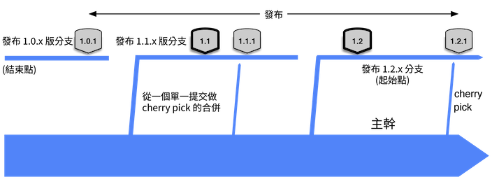
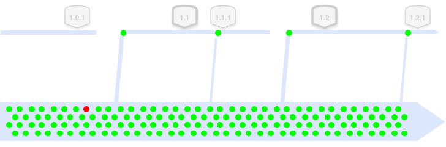
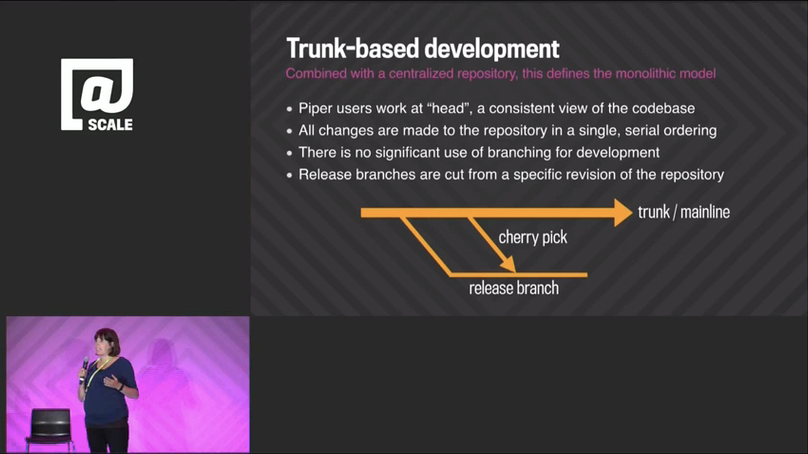


&mdash; Laura Wingerd & Christopher Seiwald 
(1998's High-Level SCM Best Practices white paper from Perforce)


If a team is pushing production releases monthly, then they are also going to have to push bug-fix releases
between planned releases. To facilitate that, it is common for Trunk-Based Development Teams to make a release
branch on a just in time basis - say a few days before the release. That becomes a stable place, given the developers
are still streaming their commits into the trunk at full speed.

The incompatible policy (ref Wingerd & Seiwald above), that the release branch "should not receive continued development work".

([key](/key/))

^ Trunk, two and a half release branches, five releases (two planned, three unplanned), and two cherry-pick bug fixes


High throughput, [Continuous Delivery](/continuous-delivery/) teams can ignore this - if they had a lemon in production, they choose a
roll-forward strategy for solving it, meaning the fix for a bug is in the trunk, and the release to production is from the trunk.


## Who is committing where?

Developers are committing (green dots) at the highest throughput rate to the trunk, and do not slow up or freeze around a
branch-cut or with proximity to a release. Developers as a group are **not** commiting to the release branch (see below).

([key](/key/))

The branch cut itself is a commit. Subversion and Perforce would technically have a bigger commit here, but all
VCS systems in use today would count the commit as 'lightweight' in terms of its impact on the history/storage,
and the time taken to create.

That red dot is an accidental build break that was fixed (somehow) soon after.

## Late creation of release branches

Some teams [release from a tag on the trunk](/release-from-trunk/) and do not create a branch at that time. That in
itself is **an alternate practice to this one, "branch for release"**.

Those teams wait for a bug that needs fixing for a released, before creating a branch from the release tag (if they are
not going to just issue another release from the trunk).  

Brad Appleton points out that many do not realize that branches can be created **retroactively**. That is taken advantage
of here in the case of bugs after "release from a tag", or even changes for point releases.

## Fix production bugs on Trunk

The best practice for Trunk-Based Development teams is to reproduce the bug on the trunk, fix it there with a test,
watch that be verified by the CI server, then cherry-pick that to the release branch and wait for a CI server
focusing on the release branch to verify it there too. Yes, the CI pipeline that guards the trunk is going to
be duplicated to guard active release branches too.


A cherry-pick merge takes a specific commit (or commits) and merges that to the destination branch. It skips
one or more commits that happened before it, but after the branch was cut. All VCS tools track which commits
 have been merged and which ones not, so you can do more cherry picks later.


### Cherry-picks from the trunk to branch ONLY

You should not fix bugs on the release branch in the expectation of cherry-picking them back to the trunk.
Why? Well in case you forget to do that in the heat of the moment. Forgetting means a regression in production some
weeks later (and someone getting fired). It can happen if things are being fixed in the night by a tired developer who
wants to get back to bed.

([key](/key/))

This rule for Trunk Based Development remains difficult to accept, even within teams practicing everything else about
Trunk-Based Development. It takes just one regression though for a policy change to be made for the team.

Of course, sometimes you **absolutely cannot** reproduce the bug on trunk. In that case you have to do it the other way round, despite
everything mentioned above, but understand you have introduced risk of regression.

### Google's Rachel Potvin on Cherry picks

Talk "Why Google Stores Billions of Lines of Code in a Single Repository" @Scale conference, Sept 2015

Rachel says (14 mins in):

"So at Google we do what's called Trunk-Based Development. I should note that it is the combination of Trunk-Based Development with a centralized repository that really defines the monolithic model of source code management. So
what Trunk-Based Development means for us that typically Piper users all work from HEAD or a single copy of the most recent version of the codebase. When developers commit to Piper their changes are immediately visible and usable by other engineers. Branching for development at Google is exceedingly rare and Trunk-Based Development is beneficial partly because you avoid the painful merges that often occur when you need to reconcile long lived branches.  Branches however are used for releases. **So a release branch is typically a snapshot from trunk with an 
optional number of cherry picks that are developed on trunk and then pulled into the branch**."

We've bolded the cherry-pick bit ourselves.  Readers with beady eyes will note that Rachel alludes to 
dev branches other than trunk for 'rare' reasons. We may cheekily suggest that Google should learn a little more about [Branch by Abstraction](/branch-by-abstraction/).

### Merge Meister role

The process of merging commits from trunk to the release branch using 'cherry pick' is a role for a single developer
in a team. Or dev pair, if you are doing Extreme Programming. Even then, it is a part time activity. The dev or pair
probably needs to police a list of rules before doing the cherry pick. Rules like which business representative
signed off on the merge. Perhaps the role should also rotate each day.

Some teams update a wiki to audit what made it to the release branch after branch cut, and some use ticket system as
this by its nature interrupting and requiring of an audit trail of approvals.

## Patch releases

It could be that your team has pushed a release out from a release branch, and now has a bug to remediate in
production. If the release cadence suits it, a cherry-pick of a bug fix from the trunk to the release branch
and a point release from the same branch is fine.

### Tag instead of branch

Releasing from a tag on the trunk is a decent optimization for many teams, if possible. The tag could be numbered for
the release (say v1.1.1), and the branch can be avoided completely. Perhaps if there is a bug in production and a branch
is retroactively created from that tag, and the patch release (see above) can happen from there.

## Release branch deletion

Release branches are deleted some time after release activity from them ceases. Not immediately, but when it is clear release is no longer in production.
That is usually when releases from succeeding release branches have gone live. This is a
harmless tidying activity - branches can be undeleted again easily enough in all VCS choices.

# References elsewhere

<a id="showHideRefs" href="javascript:toggleRefs();">show references</a>

    <table style="border: 0; box-shadow: none">
        <tr>
            <td style="padding: 2px" valign="top">1998, White Paper</td>
        </tr>
        <tr>
            <td style="border-top: 0px; padding: 2px" valign="top"><a href="https://www.perforce.com/sites/default/files/pdf/perforce-best-practices.pdf">High-level Best Practices in Software Configuration Management</a></td>
        </tr>
    </table>

