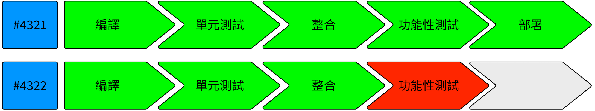

Continuous Delivery is the practice expanding your Continuous Integration (CI) usage to automatically
re-deploy a proven build to a QA or UAT environment. If the bounce time for a deployment is quick enough,
then it could be that you are doing that for every commit that lands in the shared trunk. The Radiator's pipeline view would 
become:

The [bestselling book of the same name](/publications/index.html#continuous-delivery-july-27-2010) by Jez Humble and Dave Farley, 
details the 'marching orders' for many companies, where there is whole dev-team improvement agenda.


Continuous Delivery is a broad multifaceted subject, that sits on top of Trunk-Based Development as a practice. This
website, and this page in particular is not going to give it justice. Head on over to 
`ContinuousDelivery.com` and understand too that "lean experiments" are the part 
of CD and not so much the concern of Trunk-Based Development.


## Continuous Deployment

**An automatic push all the way into production; Maybe every commit**

This is an extension of 'Continuous Delivery', but the deployment is to production. Certain types of startups like 
Netflix, Etsy and GitHub deploy their major application to production with each commit. Companies that have 
applications/services where  clients/customers could lose money are much less likely to *firehose into production*.

# References elsewhere

<a id="showHideRefs" href="javascript:toggleRefs();">show references</a>

    <table style="border: 0; box-shadow: none">
        <tr>
            <td style="padding: 2px" valign="top">2010, Jez Humble's Continuous Delivery portal</td>
        </tr>
        <tr>
            <td style="border-top: 0px; padding: 2px" valign="top"><a href="https://continuousdelivery.com/">ContinuousDelivery.com</a></td>
        </tr>
    </table>
    <table style="border: 0; box-shadow: none">
        <tr>
            <td style="padding: 2px" valign="top">5 Jan 2015, TheGuardian newspaper on their CD</td>
        </tr>
        <tr>
            <td style="border-top: 0px; padding: 2px" valign="top"><a href="https://www.theguardian.com/info/developer-blog/2015/jan/05/delivering-continuous-delivery-continuously">Delivering Continuous Delivery, continuously</a></td>
        </tr>
    </table>

