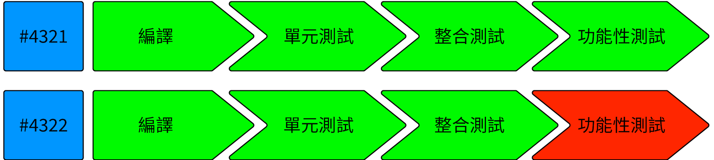
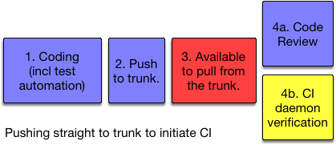
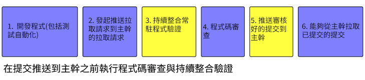

<!--

&mdash; *Agile* Steve Smith
 
-->


&mdash; *Agile* Steve Smith


<!--
## Continuous Integration - as defined

For many years CI has been accepted by a portion of software development community to mean a daemon process 
that is watching the source-control repository for changes and verifying that they are correct, **regardless
of branching model**. 
-->

## 持續整合——如同定義

多年來，不論是使用哪一種分支模型，持續整合已經被一部份的軟體社群接受為一個用來監看程式碼倉庫的變化並且驗證其正確性的常駐程式。

<!--
However, the original intention was to focus on the verification **single integration point** 
for the developer team. And do it daily if not more. The idea was for developers themselves to develop
habits to ensure everything going to that shared place many times a day was of high enough quality, 
and for the CI server to merely verify that quality, nightly.
-->

然而，最初的目的是專門為開發團隊提供**單一整合點**的驗證。並且每天進行一次甚至更多次。這個想法是讓開發者自己去養成習慣，確保每天提交到共享位置的程式品質是足夠高的，並且讓持續整合的伺服器每晚進行驗證。

<!--
CI as we know it today was championed by Kent Beck, as one of the practices he included in 
"Extreme Programming"
in the mid-nineties. Certainly in 1996, on the famous 'Chrysler Comprehensive Compensation System' (C3) 
project that Kent had all 
developers experiencing and enjoying the methodology - including the continuous integration aspect. The language for 
that project was Smalltalk and the single integration point was a Smalltalk image 
(a technology more advanced than a "mere" source-control systems that rule today).
-->

我們今天所知的持續整合是由 Kent Beck 所倡導，做為他在九十年代中期包含在「極限開發」（Extreme Programming） 中的實踐之一。可以肯定的是，在 1996 年，在著名的 *Chrysler Comprehensive Compensation System*(C3)  專案中，Kent 讓所有開發者都體驗和享受這種方法論——包括持續整合方面。該專案的語言是 Smalltalk，單一整合點是一個 Smalltalk image（一種比今天「僅僅」程式碼控制系統更先進的技術）。

<!--
Thus, the intention of CI, as defined, was pretty much exactly the same as Trunk-Based Development, that emerged 
elsewhere. Trunk-Based Development did not say anything about Continuous Integration daemons directly or indirectly, 
but there is an overlap today - the safety net around a mere branching model (and a bunch of techniques) is greatly 
valued.
-->

因此，根據定義，持續整合的意圖幾乎與在其他地方出現的主幹開發完全相同。主幹開發並沒有直接或間接提到持續整合常駐程式，但如今兩者之間存有重疊之處——圍繞簡單分支模型（以及一堆技術）的安全網非常有價值。

<!-- 
Martin Fowler (with Matt Foemmel) called out Continuous Integration in an article in 
2000, 
(rewritten in 2006), and 
ThoughtWorks colleagues went on to build the then-dominant "Cruise Control" 
in early 2001. Cruise Control co-located the CI configuration on the branch being built next to the build script, as it 
should be.
-->

Martin Fowler 與 Matt Foemmel 在 2000 年的一篇文章中提到了持續整合（重寫於 2006 年） ，而 ThoughtWorks 的同事們隨後建立了當時主導的 "Cruise Control"（在 2001 年初）。Cruise Control 將持續整合配置與下一個建置腳本放在一起，這樣做是正確的。

<!--
## Integration: Human actions

It is important to note that the build script which developers run prior to checking in, is the **same one** which is 
followed by the CI service (see below). The build is broken into gated steps due to a need for succinct communication to 
you the developer as well as teammates. The classic steps would be: compile, test-compile, unit test invocation, service test 
invocation, functional test invocation. Those last two are part of the integration tests class.
-->

## 整合：人為行為

需要注意的是，開發者在提交程式碼之前運行的建置腳本與持續整合服務使用的腳本完全相同（請參閱下文）。建置過程被分解為多個步驟，以確保與開發者以及團隊成員之間的溝通簡潔清楚。經典的步驟包括：編譯產品程式碼、編譯測試程式碼、單元測試、服務測試與功能測試。最後兩項是整合測試的一部分。

<!--
If the build passed on the developer’s workstation, and the code is up to date with HEAD of what the team sees for 
trunk, then the developer checks in the work (commit and push for Git). Where that goes to depends on which way of working 
the team is following. Some smaller teams will push straight to trunk, and may do so multiple times a day (see [Committing 
straight to the trunk](/committing-straight-to-the-trunk/)). Larger teams may push to a patch-review system, or use [short-lived feature branches](/short-lived-feature-branches/), even though this can be an impediment to throughput.
-->

如果建置在開發者的個人電腦上通過了，並且程式碼與團隊所看到的主幹版本（HEAD）保持同步，那麼開發者就可以提交工作（對於 Git 來說是提交和推送）。具體提交到何處取決於團隊採用的工作方式。一些較小的團隊可能會直接推送到主幹，有些甚至可能一天多次進行推送（請參閱[直接提交到主幹](/committing-straight-to-the-trunk/)）。較大的團隊可能會推送到一個提交修改審查系統，或者使用短期功能分支，儘管這可能會影響開發速度。

<!--
## CI services: Bots verifying human actions

Every development team bigger than three people needs a CI daemon to guard the codebase against bad commits and timing mistakes.
Teams have engineered build scripts which execute quickly. This should apply from compilation through functional 
testing (perhaps leveraging mocking at several levels) and packaging. However, there is no guarantee that a developer would run the build script before 
committing. The CI daemon fulfills that role by verifying commits to be good once they land in the trunk. Enterprises 
have either built a larger scaled capability around their CI technology, so that it can keep up with the commits/pushes 
of the whole team or they use batching of commits which takes up less computing power to track and verify work.
-->

## 持續整合服務： 機器人驗證人為的活動

每個大於三人的開發團隊都需要一個持續整合常駐程式來保護程式碼倉庫受壞的提交和時間錯誤的影響。團隊已經設計了可以快速執行的建置腳本。這應該從編譯到功能測試（也許在多個層次上利用模擬）和打包都適用。然而，不能保證開發者在提交之前運行建置腳本。持續整合常駐程式透過在提交後驗證提交來履行這一角色。企業可能會搭建了一個更大規模的持續整合技術架構，以便跟上整個團隊的提交或推送，或是使用批次提交，使用更少的計算資源來執行追蹤和驗證工作。

<!-- 
### Radiators

A popular 
radiator-style visual indication of progress would be those shown as a left-to-right series of Green (passing) or Red 
(failing) icons/buttons with a suitably short legend:

-->

### Radiator

一種流行的 Radiator 風格視覺化指標是以左至右排列的一系列綠色（通過）或紅色（失敗）的圖標或按鈕，並配有適當簡短的標題：

<!--
This should go up on TVs if developers are co-located. It should also be a click through from notification emails.
-->

如果開發者在同一個地方，應該把儀表板顯示在電視牆上。也應該提供可以直接從儀表板發送通知信的功能。

<!--
### Quick build news

The elapsed time between the commit and the "this commit broke the build" notification, is key. That is because the cost 
to repair things in the case of a build breakage goes up when additional commits have been pushed to the branch. One of the 
facets of the 'distance' that we want to reduce (refer [five-minute overview](/5-min-overview/)) is the distance to break.
 
-->

### 快速建置通知

從提交到「這個提交讓建置失敗」之間，通知消耗的時間很重要。這是因為在建置中斷的情況下，隨著額外的提交被推送到分支，修復問題的成本會增加。我們希望減少其中一個面向是從分支建置被破壞到修復的距離（參考[五分鐘概述](/5-min-overview/)）。

<!-- 
### Pipelines - further reading

Note: Continuous Integration Pipelines are better described in the bestselling 
[Continuous Delivery](/publications/index.html#continuous-delivery-july-27-2010) book. So are dozens of nuanced, 
lean inspired concepts for teams pushing that far.
-->

### 流水線——進階閱讀

註記: 持續整合流水線在[《Continuous Delivery》](/publications/index.html#continuous-delivery-july-27-2010) 這本暢銷書中有更詳細被描述與說明。該書籍還包含許多受精實（lean）所啟發的概念，適合那些力求更進一步的團隊。

<!--
## Advanced CI topics

### CI service builds per commit or batching?
-->

## 進階的持續整合議題

### 持續整合服務是按提交建置還是按批次建置？

<!--
Committing/pushing directly to the shared trunk may be fine for teams with only a few 
commits a day. Fine too for teams that only have a few developers who trust each other to be rigorous on their 
workstation before committing (as it was for everyone in the 90's).

Setups having the CI server single threading on builds and the notification cycle around pass/fail will
occasion lead to the **batching** in a CI job. This is not a big problem for small teams. Batching is where one build is 
verifying two or more commits in one go. It is not going to be hard to pick 
apart a batch of two or three to know which one caused the failure. You can believe that with confidence because of the 
high probability the two commits were in different sections of the code base and are almost never entangled.

If teams are bigger, though, with more commits a day then pushing something incorrect/broken to trunk could be disruptive to 
the team. Having the CI daemon deal with **every commit** separately is desirable. If the CI daemon is single-threading "jobs" there is a risk
that the thing could fall behind. 
-->

直接提交或是推送到共享主幹對於每天僅有少量提交的團隊可能是可以接受的。對於只有少數開發者且彼此信任在提交之前在其個人電腦上嚴謹執行的團隊來說，這也是可以接受的（就像在 90 年代的所有人都一樣）。

在持續整合伺服器上設置單執行緒進行建置和通過或是失敗通知週期，有時會導致持續整合作業中的批次處理。對於小團隊來說，這不是一個大問題。批次處理是指一次建置驗證兩個或更多的提交。對於分析兩個或三個提交中導致失敗的是哪一個並不困難。你可以放心相信這一點，因為這兩個提交很有可能位於基準程式碼的不同部分，幾乎從沒有交集。

然而，如果團隊更大，每天有更多的提交，那麼將不正確或是有問題的內容推送到主幹可能會對團隊造成干擾。理想上如果能夠讓持續整合伺服器針對每個提交獨立處理是最好的方式。如果持續整合伺服器是使用單執行緒的方式處理驗證工作，則有可能處理驗證的速度會趕不上提交的速度。

<!--
#### Controller / Agent CI infrastructure

More advanced CI Server configurations have a single controller and many agents setup so 
that build jobs can be parallelized. That's more of an investment than the basic setup, but is getting easier and 
easier in the modern era with evolved CI technologies and services. 

The likes of Docker means that teams can have build environments that are perfectly small representations of 
prod infra for the purposes of testing. 
-->

#### 控制器以及持續整合架構的代理處理程式

更加進階的持續整合伺服器設定具有一個單一的控制器與許多的代理處理程式，能夠讓建置工作能夠平行處理。這比基礎的設置還要投入更多的資源，但隨著現代持續整合技術和服務的演化，這越來越容易實現。

例如 Docker 等技術使團隊能夠擁有與測試目的相符的完整小型正式環境。

<!--
#### Tests are never green incorrectly.

Well written tests, that is - *there are fables of suites of 100% passing unit tests with no assertions in the early 2000's*.

Some teams focus 99.9% of their QA automation on functional correctness. You might note that for 
a parallelized CI-driven *ephemeral* testing infrastructure, that response times for pages are around 500ms, where the
target for production is actually 100ms. Your functional tests are not going to catch that and fail - they're going to pass. 
If you had non-functional tests too (that 0.1% case) then you might catch that as a problem. Maybe it is best to move 
such non-functional automated tests to a later pipeline phase, and be pleased that so many functional tests can run 
through so quickly and cheaply and often, on elastic (albeit ephemeral) CI infrastructure.  

Here is a claim: Tests are never green (passing) incorrectly. The inverse - a test failing when the prod code it 
is verifying actually good - is common. QA automators are eternally fixing (somehow) smaller numbers of flakey tests.

A CI build that is red/failing often, or an overnight CI job that tests everything that happened in the day - and is 
always a percentage failing is of greatly reduced value.

A regular CI build that by some definition is comprehensive, well written and **always green** unless there's a genuine
issue is extremely valuable.

Once you get to that trusted always green state, it is natural to run it as often as you can.
-->

#### 測試永遠不會錯誤地變綠色

撰寫良好的測試，有傳言說在 2000 年代初期，有些測試套件的單元測試通過率為 100%，但完全沒有做任何狀態的檢測。

有些團隊會專注於在達到 99% 的自動化檢測功能正確性。你可能會注意到，對於一個並行由持續整合產生出來的臨時測試架構，頁面的回應時間大約是 500 毫秒，而實際上在正式環境的目標時間是 100 毫秒。你的功能測試將不會捕捉到這個失敗——這將會通過功能測試。如果你也有非功能性測試（那 0.1% 的狀況），那你有可能會捕捉到這個問題。也許將這樣的非功能性自動化測試移至後續的流水線階段是最好的，而在這個彈性（暫時的）持續整合架構下可以快速、簡單且並且經常運行多個功能性測試，你會感到滿意。

有一句話這樣說：測試永遠不會錯誤地變成綠色。反過來說，一個測試很常失敗但在正式環境程式碼卻是驗證正確。品質分析自動化工程師永遠在修復少量不穩定的測試。

一個經常紅色或是失敗的持續整合建置，或是一個消耗整晚的測試當天所有一切的持續整合工作並且總是具有一定比例的失敗，將會將低持續整合驗證的價值。

一個定期的持續整合建置透過某個定義完整，妥善撰寫並且除非具有問題之外都是綠色是非常有價值的。

一旦你達到值得信賴且總是綠色的狀態，這將會很自然去儘可能運行持續整合。

<!--
### CI Pre or Post Commit?

In terms of breakages, whether incorrect (say 'badly formatted'), or genuinely broken, finding that out **after the 
commit** is undesirable. Fixing things while the rest of the team watches or waits is a team-throughput 
lowering practice. 

-->

### 持續整合應該在提交變更前或是後執行？

對於損壞或是錯誤（比如說是格式錯誤）或是真正的損壞而言，在提交變更之後發現是不理想的。修復損壞讓其他團員只能觀望或是等待是一個降低團隊生產力的不好作法。

<!--
Yellow = automated steps, Red = a potential to break build for everyone
-->

黃色的部份代表自動化步驟。紅色代表有可能讓所有人建置損壞。

<!--
Note: for committing/pushing straight to the shared trunk, code review and CI verification can happen in parallel. Most 
likely though is reviews happening after the CI daemon has cast its vote on the quality of the commit(s).
-->

註：對於直接提交或是推送變更到共享主幹作法，程式碼審查與持續整合驗證能夠同時進行。不過，最可能的情況是持續整合常駐程式驗證完程式品質後再來進行審查。

<!--
Better setups have code-review and CI verification before the commit lands in the trunk for all to see:

-->

更好的設置是在提交進入主幹供所有人查看之前進行程式碼審查和持續整合驗證：

<!--
It is best to have a human agreement (the code review), and machine agreement (CI verification) before the commit lands in 
the trunk.  There is still room for error based on timing, so CI needs to happen a second time **after** the push to the shared 
trunk, but the chance of the second build failing so small that an automated revert/roll-back is probably the best way 
to handle it (and a notification).
-->

最好的方式是在提交的變更進入主幹之前執行程式碼審查與持續整合驗證。基於時間差的關係仍然有可能有發生錯誤的機會，因此持續整合驗證需要在提交的變更進入主幹之後再度執行一次，雖然在第二次建置失敗的機會很小，當發生建置失敗時自動恢復或是回滾並且發送通知是最佳處理方式。

<!--
### The high bar, today

Highest throughput teams have CI server setups that prevent breakage of the trunk. That means that commits are verified
before they land in the trunk to the extent where teammates can update/sync/pull.
-->

### 今天的標準

高效率的團隊具有持續整合伺服器，可以避免主幹被破壞。這代表在提交的變更進入主幹之前都會被驗證，整個團隊的人都可以安心的對主幹進行更新或同步以及拉取最新的提交。

<!--
The problem this solves is when the rate of commit into the trunk would be too high to have an auto-rollback on build 
failure. In Google one commit lands in the trunk every 30 seconds. Few CI technologies (and source control systems) can 
keep up with that in a way that is not batching (to some degree of interpretation). You'd be stopping the line too often 
for humans to make sense of a train wreck of red builds, where only one two were actual breakages rather than just bad 
timing.
-->

要解決的問題是，當提交變更到主幹速度太快時，無法在建置失敗時自動回復到原本成功的狀態。在 Google，每 30 秒就有一個提交會進入主幹。很少有持續整合技術（與程式碼版本管理系統）可以跟上這種速度，而不是批次處理（在某種程度上）。你將會停止整個產線太多次導致人們無法理解一連串失敗建置的意義，而其中只有一兩個是真正的失敗建置，而不是因為過短時間提交導致的失敗。

<!--
It would not be computationally hard
to recreate a last-green-plus-this-commit contrived HEAD to verify a commit in isolation to the other 20 that arrived in 
the last ten minutes, but that would be a crazy amount of computing power to do so. Better to marshal the pending 
commit in a place where it looks like it is immediately following a previously known green (passing) commit and is not yet on 
the shared trunk.
-->

重新建立在一個最新建置成功提交加上一個提交的虛擬 HEAD 來驗證這個提交與其他 20 個在十分鐘獨立提交的變更並不難，但這需耗費大量的計算資源。最好的方式是把等待驗證的提交集中整理到一個地方，這個地方放置的提交都是緊隨著上一個成功建置的提交但還沒放入主幹。

<!--
That place has a name - a branch (or a branch of a fork the GitHub way). It is a perfect place to CI verify the commit
before auto-merging it to the shared trunk (if you want to auto-merge after code review approvals). 
-->

這個地方有一個名字——分支（或是在 GitHub 中所謂的一個複製出來的分支）。這是最適合用來在自動合併提交到主幹之前執行持續整合驗證提交變更的地方（如果你希望在程式碼審查通過後做自動合併）。

<!--
The new problem is how do you prevent that [short-lived feature branch](/short-lived-feature-branches/) from sleepwalking into a long-lived feature 
branch with half a dozen developers keeping it from being 'complete' (somehow) and merged back. You cannot with tools
today, but it would be cool if you could have a ticking clock or count down on those branches at creation to enforce
its 'temporary' intention.
-->

新的問題是如何防止這個[短期功能分支](/short-lived-feature-branches/)演化成一個由六人以上的開發者處理由於某些因素無法完成的長期功能分支並且想要合併回主幹。現有的工具無法做到這一點，但如果你可以在建立分支時有一個倒計時或計數器，以強制執行其「暫時」的意圖，那將是很酷的。

<!--
Refer to [Game Changers - Google Home Grown CI and Tooling](/game-changers/index.html#google-s-internal-devops-2006-onwards) for more 
information on the high commit rate CI stuff. Note too that they do not have a temp branch set up to facilitate that.
-->

有關於高效率的提交變更與持續整合驗證的議題，可以參考 [變革推動者 - 自家開發的持續整合（CI）與工具](/game-changers/index.html#google-s-internal-devops-2006-onwards) 這篇文章。請注意到在文章中沒有設置臨時分支來支持這一點。

<!--
## Industry CI daemon confusion

ThoughtWorks commissioned a survey - "No One Agrees How to Define CI or CD".   
That the hypothesis of Continuous Integration being thought of as compatible with branching models other than Trunk-Based Development
was, unfortunately, shown to be true. Their chief scientist, Martin Fowler, writes about the general effect in his "Semantic Diffusion"
article. 
-->

## 業界持續整合常駐程式的分歧

ThoughtWorks 被委託進行了一項調查——「沒有人知道該如何去定義持續整合或是持續交付」。不幸地是，除了主幹開發之外這項假設已經在所有相容於持續整合的分支模型上證實為真。他們的首席科學家 Martin Fowler 在 "Semantic Diffusion" 這篇文章有談到了這一普遍影響。

<!--
Martin also wrote specifically on the 
lamentable *pat on the back* that multi-active-branch teams give themselves when they set up a CI server/daemon for one
or all of those branches: "Continuous Integration Certification" 
 and within that *a great
coin* "Daemonic Continuous Integration" for this effect.
-->

Martin 還特別寫到使用多個活躍分支模型的團隊為了其中一個分支或是全部分支設置了一個持續整合常駐程式，使得分支能夠具有自我回復的功能：在「Continuous Integration Certification」中提到了這一效果，其中還包括了「常駐式持續整合」的描述。

<!--
 
Given other popular branching models (that are not Trunk-Based Development) **also** benefit from CI servers watching 
for and verifying commits, this site is going to refer to the commit to a **enforced single shared source-control branch* 
practice as Trunk-Based Development.

-->


基於其他流行的非主幹開發分支模型也受益於持續整合伺服器持續監測並且驗證提交的變更。所以本網站也將會把強制限制變更提交到單一程式碼控制分支的練習稱為主幹開發。


<!--
There are many CI technologies and services available for teams to use. Some are free, and some are open source. 
Some store the configuration for a pipeline in VCS, and some store it somewhere else. In order to more smoothly support
[branch for release](/branch-for-release/), the best CI solutions co-locate the configuration for a pipeline in the same 
branch too.
-->

現在有許多可用的持續整合的技術與服務可以讓團隊來使用。有些是免費，有些是開源。有些則需要儲存關於持續整合程式的設定在版本控制系統上，另外有些則是儲存再其他地方。為了更方便能夠做到[為發布建立分支](/branch-for-relase/)，最好的方法是相關持續整合程式的設定儲存在同一個分支。

<!--
## Server/daemon implementations

* Jenkins commercial service, for Jenkins Open Source - on-premises installable
* Travis-CI - cloud
* Circle-CI - cloud
* ThoughtWorks' Go CD - cloud and on-premises install
* Codeship - cloud
* Atlassian's Bamboo - on-premises install
* JetBrains' TeamCity - on-premises install
* Microsoft's TFS platform - on-premises install (built into larger platform)
* Codefresh - cloud, on-premises and hybrid (bring your own runner) install
-->

## 持續整合伺服器或常駐程式的實作

* Jenkins 商業服務, 由 Jenkins 開源 - 可以在本機安裝
* Travis-CI - 雲端服務
* Circle-CI - 雲端服務
* ThoughtWorks' Go CD - 雲端服務以及可以在本機安裝
* Codeship - 雲端服務
* Atlassian's Bamboo - 可以在本機安裝
* JetBrains' TeamCity - 可以在本機安裝
* Microsoft's TFS platform - 可以在本機安裝（被建置在一個大平台上）
* Codefresh - 雲端服務，可以在本機安裝以及混合型（自行配置自己的執行程式）安裝

<!--
Note, for Jenkins, you can now use Pipeline DSL scripts (or Groovy)  (formerly Workflow), or you can use Jenkins with GroupOn's DotCI to co-locate the config
with the thing being built/verified in source-control.
-->

特別注意的是，對於 Jenkins，可以使用 Pipeline DSL 腳本（或 Groovy）  （原名 Workflow），或者你可以使用 GroupOn 的 DotCI  來配置設定來驗證以及建置在版本控制系統中的每個提交更新。

<!--
# References elsewhere

<a id="showHideRefs" href="javascript:toggleRefs();">show references</a>
-->

# 其他參考資料 {#references-elsewhere}

<a id="showHideRefs" href="javascript:toggleRefs();">顯示參考資料</a>

    <table style="border: 0; box-shadow: none">
        <tr>
            <td style="padding: 2px" valign="top">10 Sep 2000, MartinFowler.com Article</td>
        </tr>
        <tr>
            <td style="border-top: 0px; padding: 2px" valign="top"><a href="https://www.martinfowler.com/articles/originalContinuousIntegration.html">Continuous Integration - original version</a></td>
        </tr>
    </table>
    <table style="border: 0; box-shadow: none">
        <tr>
            <td style="padding: 2px" valign="top">18 May 2006, MartinFowler.com Article</td>
        </tr>
        <tr>
            <td style="border-top: 0px; padding: 2px" valign="top"><a href="https://www.martinfowler.com/articles/continuousIntegration.html">Continuous Integration</a></td>
        </tr>
    </table>
    <table style="border: 0; box-shadow: none">
        <tr>
            <td style="padding: 2px" valign="top">18 May 2015, Hangout Debate</td>
        </tr>
        <tr>
            <td style="border-top: 0px; padding: 2px" valign="top"><a href="https://www.youtube.com/watch?v=30yN4hefrt0">Branching strategies and continuous delivery</a></td>
        </tr>
    </table>
    <table style="border: 0; box-shadow: none">
        <tr>
            <td style="padding: 2px" valign="top">02 Sep 2015, Conference Presentation</td>
        </tr>
        <tr>
            <td style="border-top: 0px; padding: 2px" valign="top"><a href="https://www.infoq.com/presentations/death-continuous-integration">The Death of Continuous Integration</a></td>
        </tr>
    </table>

