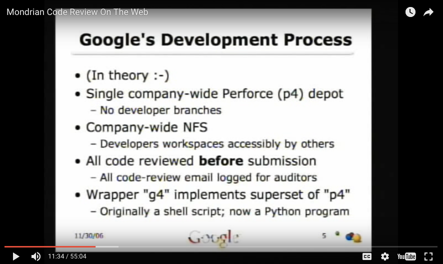
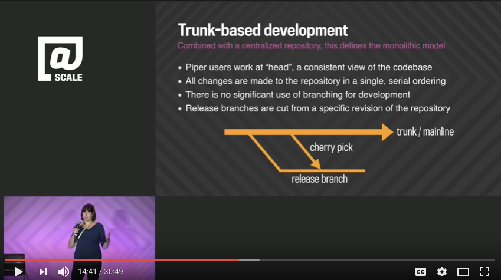

Since the early 80's a number of things have pushed best practices **towards** Trunk-Based Development, or **away** from it.

The language in use to describe such things has changed over time. Software Configuration Management (SCM) is used less
today than Version Control Systems (VCS) is. A simpler still term - "Source Control" - seems to be used more recently,
too.

Similarly, 'trunk' and 'branch', have not always been used as terms for controlled code lines that have a common
ancestor, and are eminently (and repeatably) mergeable.

## Revision Control System - RCS (1982)

RCS was a simple but 'early days' version control technology, by Walter F. Tichy.

In Tichy's 1985 paper
"RCS - A System for Version Control", a trunk
focused mode of use is described as a "slender branch". In section 3.1. "When are branches needed?",
he says that you step away from the trunk for four reasons:

&ldquo;
A young revision tree is slender: It consists of only one branch, called the trunk. 
As the tree ages, side branches may form. Branches are needed in the following 4 situations. 
Temporary fixes, Distributed development and customer modifications, Parallel development, and Conflicting updates.

Two of those, Tichy suggests, are temporary branches and would come back to the trunk at the earliest opportunity.

Superficially, RCS allowed multi-branch parallel development, but some teams were very careful and stuck
to a 'slender', or Trunk-Based Development mode of use.

Note: Over time all version control systems would adopt this branch/merge language.

## Concurrent Versions System - CVS (1990)

A handful of scripts created in 1986 by Dick Grune, were fashioned into an initial release of CVS
in 1990. For the open source community, CVS was it until Subversion came along years later. The adoption of CVS in the
young open source community spurred its adoption in the enterprise too. While many branching models were possible,
merging was painful and Trunk-Based Development was the sensible choice. Indeed CVS popularized the "trunk" branch name, even if it didn't mandate it.  CVS's flaws were that it did not have atomic commits, its operation over the wire as a centralized client/server VCS was very chatty, and it had cumbersome CVS/ directories all over the checked out code.

## Microsoft Secrets book (1995)

Microsoft Secrets: How the World's Most Powerful Software Company Creates Technology, Shapes Markets and Manages
People (Michael Cusumano & Richard Selby, 1995)

The book was translated into 14 languages, and a bestseller, and was about practices that solidified withing Microsoft
for a few years before.

There's a section in *Microsoft Secrets* dealing with Microsoft's per-developer workflow using Source Library Manager
(SLM) on  a one-branch model (the book does not use the words trunk or branch). SLM (AKA "slime") - was an internal
tool Microsoft used for source-control. The *daily* developer workflow with SLM was:

1. checkout (update/pull/sync or checkout afresh)
2. implement feature
3. build
4. test the feature
5. sync (update/pull)
6. merge
7. build
8. test the feature
9. smoke tests
10. check in (commit/push)
11. makes a daily build from HEAD of the shared master branch

The authors note in the book, that #10 is not always an everyday thing. And the last step, #11, is not per developer, it is
for the designated "build master" within the team, and manual. This workflow was initially pioneered in the Excel group,
and then Word, and then Windows NT, and the timespan for this way of working was from around 1989 through 1995 when the
interviews completed and the book published.

The book also briefly mentions Test Case Manager (TCM) and "Microsoft Test". These were tools for helping developers
manage and record/edit/playback application tests at their workstations. It is not clear if all SLM-using teams
also used these, but the Excel team did (as they maintained the former at least).

These are clearly practices to support teams working in a trunk model.

Notes:

1. Steve McConnell's Rapid Development (1996) also reinforces #11 - make a daily build.

2. In 2000, ex Microsoftee and early blogger Joel Spolsky would extol the virtues of #11 in his famous
"The Joel Test" posting.

## NetScape's Tinderbox (1997)

NetScape (now Mozilla) had a service that compiled and tested bits and pieces of their open-source offerings together. That service was
Tinderbox and it debuted for the public to see in 1997. Their source organization was single-branch in the trunk style
managed by CVS, and allowed individual developers to checkout and keep abreast of only the pieces they wanted/needed to. Tinderbox
was the safety net that ensured everything was correct across all the whole trunk. It ran until it wouldn't scale anymore
in 2014.

## Perforce and ClearCase (1998)

Perforce and ClearCase bit into the corporate VCS market significantly. Both, as technologies, were
open to any branching model and implementing teams chose differently. In the end, though, people's newfound willingness
to experiment with multiple parallel active branches won out, and we had some dark years generally for Trunk-Based
Development ahead, even if branch names sometimes included 'trunk'. Both Perforce and ClearCase has decent merge
tracking, but Perforce was much faster on the wire.

Microsoft installed a custom build of Perforce called "Source Depot". It took over from SLM/Slime (mentioned above).
We are not sure, but Microsoft may have embraced the possibility of multiple active branches (rather than
Trunk-Based Development) back then within their Source Depot (SD) setup.

By contrast, Google installed Perforce (see below) and embraced a Trunk-Based Development model with it from the outset.
They rose to every scaling challenge with extra tooling around it, including more than a few actual inventions of
technology and technique (see below).

### Perforce's High-Level SCM Best Practices white paper

Laura Wingerd and Christopher Seiwald penned this widely read paper
 that was presented at an SCM conference in Brussels the same year.

The paper alternates between 'trunk' and 'mainline' language, but has many valuable nuggets in
it that help set a foundation for the next ten years of version-control advances.

## Extreme Programming's Continuous Integration (1999)

Kent Beck published "Extreme Programming Explained" in 1999.
Picked out that, amongst a bunch of practices for the influential XP methodology, is "Continuous Integration"
that Kent felt was "risk reducing".

He says "Integrate and build the system many times a day, every time a task is completed", and goes on to detail
a reserved workstation, that a developer pair would sidle up at the appropriate moment to prove that their code
contribution was integrateable, and therefore good for teammates to depend on at that moment. That last notification
was often oral at that time "build passes, gang".

He calls out a requirement for "fast integration/build/test cycles". This is key. In fact, every pro Trunk-Based Development
game changer listed in this page was facilitated by faster builds generally (versus a predecessor technique for the team
in question). And, no, faster did not mean delete or comment out automated test execution in the build. Faster meant to reduce
the elapsed time to "a few minutes" (Kent again).

Kent had pioneered (with many industry luminary friends) in 1996 on the famous Chrysler Comprehensive Compensation System
(C3) project. The C3 project used Smalltalk as its language, and OTI's ENVY was the version control tool used. It is
important to note that today's CR-delimited text file systems are blunt instruments compared to the fine-grained
directed graphs with fidelity down to class/method history of each of those. It was more like a multidimensional
database with cross-cutting tags representing HEAD, or someone else's important combination of those three. It was
omnipresent too - a decision made to move HEAD was instantly available without 'update' action to teammates.

## Continuous Integration paper on MartinFowler.com (2000)

Martin Fowler and Matt Foemmel wrote an influential article "Continuous
Integration" in 2000,
calling out this one part of XP. Martin greatly updated it in 2006
.

## ThoughtWorks' Cruise Control (2001)

Martin's ThoughtWorks colleagues (Alden Almagro,
Paul Julius,
Jason Yip) went on to build the then-dominant
"Cruise Control" starting in early 2001 (for CVS, StarTeam). This was a
groundbreaking technology and very accessible to companies wanting a machine to fully verify checkins. ThoughtWorks
already had success the year before with the same server design on a client project, and CruiseControl was the
rewrite (from scratch) in order to make it open source. CruiseControl was quite successful in the enterprise and was
and easy decision after teams had read the Continuous Integration paper above.

Early CI servers, including CruiseControl used to have a "quiet period" to make sure they had received every last
element of an intended commit. To facilitate that, only one pair of developers was allowed to checkin at a time. With
CVS the other developers in the team could only do their "cvs up" when CruiseControl had given the green light,
automating that "build passes, gang" oral notification above. A particular non-functional feature to note for
CruiseControl was that it stored its 'pipeline' configuration in source-control. In fact, that was alongside the
project's source and build file - developers could tweak CI configuration in a commit.

## Apache's Gump

Apache's Gump was built on a similar timeline to CruiseControl but focused more on the binary integration hell of
interdependent Apache (and other) open-source projects. It gave an early warning of integration clashes that were
already or were about to be problematic, for teams. While impressive, it did not gain traction in the enterprise.
This is because enterprises were able to be more buffered from open-source library hell (and the implicit diamond
dependency problem), by limiting the rate at which they upgraded their third-party binary dependencies.

Gump creator, Sam Ruby remembers:

&ldquo;
The original motivation for Gump wasn't so much continuous 
as it was integration - in particular, integration in the large. 
Many projects had unit tests but would routinely make changes 
that would break their 'contract' and nobody would notice until 
well after the changes were released.

## Subversion's "lightweight" branching (2000 through 2001)

Karl Fogel helped start Subversion and remembers one early goal was "CVS + atomicity". **The lack of atomicity in CVS
meant that teams had to coordinate as to who was checking in at any one time** and whether they would avoid
accidentally breaking the build as a result. Early CI servers (as mentioned) used to have a "quiet period"
to make sure they had received every last element of an
intended commit, and that was no longer needed for Subversion and its atomic commits.

In comparison to the clunky CVS, Subversion had "lightweight" branching. This made it easier to consider multiple
branches active in parallel and merge the team's changes back later.

Until v1.5 in June 2008, Subversion had an inadequate "merge tracking" capability, eliminating a class of problems
inherent in branching and merging. The internal mechanism of noting the merge tracking was controversial though, and
Subversion still has edge-case merge bugs today. Like this one.

Subversion by default setup a branch called trunk. That said, it allows any branching model to be used.

## Git's "lightweight" branching (2005)

In comparison to the clunky Subversion, Git had "lightweight" branching.
This made it easier to consider multiple branches as active (in parallel) and merged back later. Git's merge engine
was very good too, and had merge tracking from the start. It was more able than prior merge technologies to
silently process complexity.

A critical part of Git was local branching. A developer could make multiple local branches, and even map them to the
same remote branch. Say one could be a feature, part complete and another a surprise bug fix to go back first. Or the
developer could be making alternate implementations of the same complicated thing, to decide later which to push back.
Git does not need a centralized server repo, but enterprise teams are going to have one anyway.

Lastly, Git came with a capability to rewrite history. Although this was a general feature, it is where the history
around your local HEAD is rewritten before you push it back to the shared repository, that is of interest. Say your
Agile story was four tasks and there for four local commits, you can effectively squash those into one commit
before you push it back to the shared repository. There are pros and cons to that, but having the choice is cool.

Generally, Git made it much easier to consider multiple branches as a viable team setup.

## Google's internal DevOps (2006 onwards)

Google's DevOps quest started in 1998, but was only really shared externally from 2006 onwards.

Note: Google were practicing Trunk-Based Development since the beginning - Craig Silverstein (the first hire) remembers
setting it up that way. Much of these were secret to Google until much later, including their recommendations for a
70:20:10 ratio for small:medium:large tests, where 'small' were sub-1ms unit tests (no threading, no I/O), 'medium'
were unit tests that didn't qualify for *small* (and probably did TCP/IP headlessly to something), with 'large' being
slower more costly Selenium functional tests. Pyramid like, and in the early to mid-2000's.

### Home-grown CI and tooling

This was 2002 onwards, but only barely documented outside Google, thus the influence is much smaller.

Google is the most famous example of using Scaled CI infrastructure to keep up with commits (one every 30 seconds on
average) to a single shared trunk. Google's setup would also allow the same infrastructure to verify *proposed* commits.

Their VCS technology, at the outset, was Perforce, and it did not have an ability
to effectively do CI on commits that had not yet landed in the trunk. So Google made their own tooling for this and
pending commits were plucked from developer workstations for verification (and code review - see "Mondrian" below).
After its initial creation, Google's now "Google3" setup, gained a UI, Mondrian (see below)
which made the results of the pre-commit CI verification very clear.

### Mondrian (2006)

Tools for code-reviewers/approvers of proposed contributions to trunk were developed internally at Google in the early
2000's as a command-line tool and part of "Google 3". Things would not land in the shared trunk until everyone agreed.
Their culture was that such that reviews were speedy. Getting pending commits to the point of rejection or acceptance
("Looks Good To Me": LGTM) was almost competitive. Some new Googlers (Nooglers) would pride themselves about taking
on random code-review chores and being one of a few people that weigh into the decision moment.

The code review technology marshaled changes for proposed commits to the trunk and stored them outside the VCS in
question (in a database probably). To do that the tech would reach into the developer machine and the appropriate
moment and make a tar.gz of the changes and the meta-data around them, and pull that back to the central system
for global presentation. Anyone could review anything. A review was just on a commit (not a batch of commits). Therefore
code review was continuous.

Reviewers could quickly bring the
marshaled change down to their workstation to play with it, or use it as a basis for a counter proposal. They could put
that back in review again.

In 2006, Guido van Rossum presented one of his bigger contributions - "Mondrian" -
to Googlers. Here is that 'tech talk' on YouTube:

<iframe src="https://www.youtube.com/embed/sMql3Di4Kgc" style="position: absolute; top: 0; left: 0; width: 100%; height: 100%;" allowfullscreen="" frameborder="0"></iframe>

<!-- print  print -->
<!-- print   print -->
<!-- print <a href="https://youtu.be/sMql3Di4Kgc">Video Available at https://youtu.be/sMql3Di4Kgc</a> print -->

Note at the start he says XP practice
"Pair-Programming" is best, and that code review helps fill the gap for situations where you cannot do it.

See Rietveld and Gerrit further on, for continuations of the Mondrian story.

### Selenium Farm (2006)

Google CI infrastructure was expanded to have **a second tier of elastic infrastructure**, for scaled Selenium/WebDriver
testing.

This "Selenium Farm" (internal cloud) was also available to developers at their desks, who just wanted to run such tests against a stood-up
version of what they were working on. Teams who had to run Firefox (etc) on their own desktop on a Friday, were able
to lease one or more Firefox browsers  in parallel on a Monday, and no longer lock up their developer workstations.

Other companies since have been able to deploy their own Selenium-Grid internally or
leverage one of the online services for elastic Selenium testing.

## Branch by Abstraction technique (2007)

Paul Hammant blogged about a 2005 ThoughtWorks client engagement in a Bank of America software development team,
that used the Branch by Abstraction technique.
Whereas many had previously used this technique to avoid longer version-control branches in a trunk model, this was the
first time it had been detailed online and given a name (by Stacy Curl).

## GitHub's entire initial platform (2008)

GitHub was launched as a portal on February 8, 2008, and features have been added steadily ever since. The initial
version contained forks, which was a formal way of expressing the directionality of related DVCS repositories, and
promoting a forgiveness model for unsolicited changes to source code (as opposed to the permission model that preceded it
for other portals).

### Pull Requests (2008)

GitHub added "Pull-Requests" (PRs) on Feb 23rd, 2008,
while in beta, and popularized the entire practice for the industry when they came out of beta in April of that year.
For source/repo platforms, and VCSs generally, this and "forking generally" was a total game changer, and commercial
prospects of other companies were decided based on their ability to react to this culture change.

#### Code Review built in

Pull Requests came with an ability to leave code review comments for the contribution. That meant that "upstream"
receivers of contributions could parry them with feedback, rather than consume them and fix them which was common
previously.

#### No more clunky patch sets

GitHub's PR system used real branches in Git, and the forks aspect took advantage of the 'D' distributed in DVCS
(albeit distributed to somewhere else in GitHub's server-side directory structure).

The open-source community for one could now step away from patch-sets that were donated by email (or other rudimentary mechanisms).
This forced the entire VCS industry to take note, and plan equivalents, or commit to witheritng in terms of market
share. It greatly facilitated multi-branch development for teams of course, including (sadly) multiple long-lived
branches.

Pull-Requests changed the dynamics of open source. Now, the original creator of open source was forced to keep up
with PRs because if they did not, one fork with more activity and forward momentum, might steal the community. Perhaps
rightfully so.

#### Timing

In terms of timing GitHub's PR-centric code review was available for open-source use a couple of months before
Google's Rietveld was released, but a 18 months or so after Mondrian was presented in a tech talk that was put out on 
video.google.com.  A few years later Google turned off video.google.com and moved the Mondrian tech-talk video to Youtube 
with its 2006 heritage being a mere note in the "Published on Aug 22, 2012" posting.

### Rietveld code Review (2008)

After Mondrian and while at Google, Guido released Rietveld
in its image (May, 2008) and a fork of that the Gerrit (Oct, 2008) gained a lot of
interest. Facebookers went on to make a similar Phabricator
and released that as open source too (Oct, 2010).

## Continuous Delivery Book (2010)

See [Publications - Continuous Delivery](/publications/index.html#continuous-delivery-july-27-2010)

Jez Humble and Dave
Farley wrote this influential book after a
ThoughtWorks project in London that finished in 2007.
The client was AOL - enough time has passed to share that. Specific DevOps advances were
being made across the industry, but a critical aspect of this mission was that the prescribed go-live date was tight, given the known
amount of work to be completed before then. Tight enough to want to compress the classic 'coding slows down, and
exhaustive user acceptance testing starts' phase of a project. The team had to pull the trigger on plenty of
automated steps, to allow faster feedback loops. This allowed then to have a high confidence in the quality of commits, from only
minutes before. CI pipelines and delta-scripts for database table-shape migrations, in particular, were focused on.

The 2010 'Continuous Delivery' book is the bestselling result. It has been translated into three languages since, and
both authors now have careers that further deliver/describe the benefits for clients. The book ties the foundational
aspects of DevOps, Continuous Integration pipelines, and tight lean-inspired feedback loops together to get a broad
and deep definition of how we should develop software collectively in 2010 and onwards.

Anecdotally the pipelines thinking captures a linear representation of Mike Cohn's famous "Test Pyramid" from his 2009 book,
"Succeeding with Agile". See Mike's blog entry a month
later too,
as well as Martin's recap in 2012.

Dan North (Mr. BDD), Chris Read
(an unsung DevOps pioneer) and Sam Newman were also key in the AOL advances.
Dan North gave a deeper account of the mission at GOTO in 2014
(no video sadly) and was interviewed later by InfoQ.

A year or so before that mission, Sam and Dave were on a different client, UK retailer 'Dixons'. They were part of a team rolling out  
emergent DevOps practices, which they would get to reuse and refine on the following AOL mission. Standouts were:

1. making the test environments have consistent behaviour with production environments (very close by not quite 'Infrastructure as Code')
2. QA automation technologies setup by the dev team
3. inducting/co-locating individual QAs with the dev team
4. Test Driven Development (TDD)
5. Acceptance Test Driven development (ATDD)
6. a CI pipeline that included performance tests
7. a focus of team dynamics for high throughput

## Travis-CI's GitHub integration and pass/fail badges (2011)

In 2011, Travis-CI provided easy integrations into GitHub's platform run CI
builds for Pull Requests and the general state of HEAD on any branch. This was visually indicated with "build passes" and
"build fails" badges were inserted into the GitHub UI.
This made it was clear whether the proposed PR would break the build or not were it to be merged into trunk.

## Microservices (2011 and 2012)

The emergence of micro-services as small buildable/deployable things that are glued together with TCP/IP (and
XML/YAML/DNS configuration) reinforced "many small repositories" (they kind of reinforce each other really), while this can be
done with any branching model, the non-trunk models probably had the mindshare. Monorepos were out completely. A
possibility from monorepos teams sharing code and source level a HEAD revision, positively laughed it. The history
page of Wikipedia lists multiple people concurrently pushing the same emergent micro-service
idea.

## Case Study: A Practical Approach To Large-Scale Agile Development (2012)

Gary Gruver, Mike Young, and Pat Fulghum wrote
"A Practical Approach To Large-Scale Agile Development"
to describe the multi-year
 transformation programme in the HP LaserJet Firmware division. In 2008, there were over 400 engineers dotted around
 the world working on over 10 million lines of printer firmware code in the HP LaserJet Firmware division. There
 were 10+ long-lived release feature branches (one for each product variant), with 1 week required for a build and
 6 weeks required for manual regression testing. The engineers spent 25% of their time working on product support i.e.
 merging features between branches and only 5% of their time on new features.

 For the next couple of years, HP committed to a huge investment in Trunk-Based Development and
 Continuous Integration. All product variants were rearchitected as a single product on a Git master, per-variant
 features extracted into XML config files, all engineers worldwide were given the same virtual machine for development,
 and a huge multi-tier continuous build process was fully automated in-house. The results were outstanding, with build
 time reduced to 1 hour and manual testing replaced with a 24 hour fully automated test suite including printing
 test pages. 10-15 builds could be produced a day, engineers spent 5% of their time not 25% on product support and 40%
 of their time not 5% of their time on new features. That is an 8x increase in productivity for 400 engineers.

## TravisCI's per-commit speculative mergeability analysis (2012)

TravisCI was the first CI service to 
automatically predict a GitHub pull-request's mergeability AND build success/failure 
as if they had landed in master. Specifically:

1. a speculative merge back to the master/trunk/mainline - only into working-copy as it is for analysis only
2. all the classic compile/unit-test/integration-test/functional-test steps of the regular build, in situ

The speculative merge is discarded every time after #1 (if it can't merge) or #2 (regardless) -
the actual merge result is never pushed off the build server to the remote (in Git terms). It is only the "is this
buildable and mergeable or not" notification that was desired from the exercise.

This feature of TravisCI is for [short-lived feature branches](/short-lived-feature-branches/), 
it is clear now that teams should do
this CI setup **regardless of their branching model**. Yes, even the long-lived branching models also benefit from this,
though they'll be challenged to stay 'green' the whole time, and remain eminently and automatically mergeable back to
the mainline/master.

A few months later, Team City implemented the same feature - , 
and a year later Snap-CI also did 

What is a reality
in 2017 is that the high bar is every commit, **every branch**, with that speculative merge, and elastically scaled so
that the notification is within seconds of pushing the commit to the shared VCS. Back in 2001 (CruiseControl) we were batching
commits, we would wait a little while to allow checkins to finish (particularly for the non-atomic CVS), and humans would
have to pick apart who actually broke the build.

Surely teams not doing Trunk-Based Development would turn on this speculative merge and build capability for every branch and soon after plan their migration to Trunk-Based Development.

## PlasticSCM's semantic merge (2013)

Plastic's semantic diff and merge capability was launched in March
2013. It allowed a greatly reduced diff for
refactoring commits.

If merges between branches are required, and larger
code changes (like refactorings) are desired, then multi-branch development is a little easier with this. However, Trunk Based
Development's commits are more elegant too, because of it, and in the fullness of time, it might make
on techniques like Branch by Abstraction easier, or reduce the need for it, if merge conflicts happen less often
(according to source-control) for something in 2012 that would have been a definite clash.

Other source-control tools are not doing semantic diff/merge yet (2017), but they should be. Semantic merge is
just as useful for Trunk-Based Development and multi-branch models. It means that there are less likely to be clash
situations for commits a developer wants to do. Maybe that last vision is not quite complete yet, but there's a direction
 to go in now.

## Google revealing their Monorepo Trunk (2016)

In none other than the Association for Computing Machinery's magazine, Googlers Rachel Potvin and Josh Levenberg share
how Google arranges for 95% (25,000) of its software developers to share one trunk in "Why Google Stores Billions of
Lines of Code in a Single Repository".
They use a [Monorepo](/monorepos/) variant of a trunk, with internal code shared at **source level**, for high-throughput,
low-defect delivery of multiple applications and services. Each application/service has a release cadence chosen by the dev+biz
team in question. Yes, everything works just fine.

A couple of months later, Rachel Potvin presented at the @Scale Conference on the same topic - "Why Google Stores Billions of Lines of Code in a
Single Repository":

<iframe src="https://www.youtube.com/embed/W71BTkUbdqE" style="position: absolute; top: 0; left: 0; width: 100%; height: 100%;" allowfullscreen="" frameborder="0"></iframe>

<!-- print  print -->
<!-- print   print -->

## Microsoft's Git Virtual File System (2017)

Microsoft released ~~GitVFS~~ GVFS in early 2017 on GitHub.

This new technology deserves time and analysis before the full impact is determined. There is a suggestion from Brian Harry's
blog that branch reduction was one of
the motivators.

# References elsewhere

<a id="showHideRefs" href="javascript:toggleRefs();">show references</a>

    <table style="border: 0; box-shadow: none">
        <tr>
            <td style="padding: 2px" valign="top">13 Nov 2013, Talk</td>
        </tr>
        <tr>
            <td style="border-top: 0px; padding: 2px" valign="top"><a href="https://www.youtube.com/watch?v=2QGYEwghRSM">A Practical Approach to Large Scale Agile Development</a></td>
        </tr>
    </table>
    <table style="border: 0; box-shadow: none">
        <tr>
            <td style="padding: 2px" valign="top">14 Jan 2015, Blog entry</td>
        </tr>
        <tr>
            <td style="border-top: 0px; padding: 2px" valign="top"><a href="http://dizzythinks.net/from-212-days-to-212-seconds-the-birth-of-devops.html">From 2½ Days to 2½ Seconds - the Birth of DevOps</a></td>
        </tr>
    </table>
    <table style="border: 0; box-shadow: none">
        <tr>
            <td style="padding: 2px" valign="top">23 Apr 2015, Blog entry</td>
        </tr>
        <tr>
            <td style="border-top: 0px; padding: 2px" valign="top"><a href="http://paulhammant.com/2015/04/23/the-origins-of-trunk-based-development/">The origins of Trunk-Based Development</a></td>
        </tr>
    </table>

