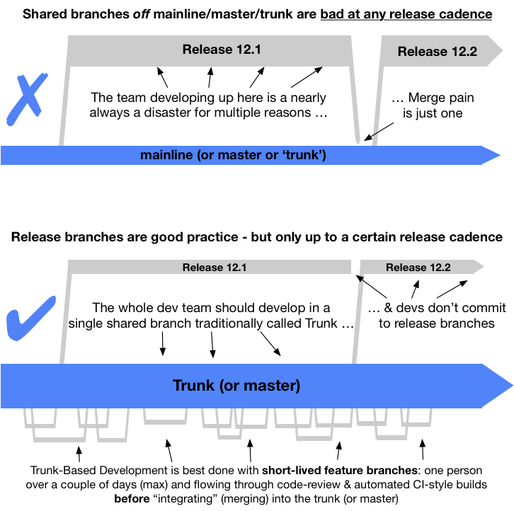

<!-- print <h1 style="color: white; padding: 32px 20px 72px; background-image:url(/images/LogoSlim.png); background-repeat: no-repeat; background-size: 100% auto">Introdução</h1> print -->

## Resumo em poucas palavras

Um modelo de branching para sistema de controle de versão, onde desenvolvedores colaboram em uma única branch denominada 'trunk' *, resitem a qualquer pressão para criar branches de longa duração ao aplicar técnicas documentas. Deste modo, evitam o merge infernal, não quebram o build e vivem continuamente felizes. 

([key](/key/))

 &ast; *master*, no contexto do Git

Desenvolvimento Baseado em Trunk é um elemento chave da [Integração Contínua](/continuous-integration/) e [Entrega Contínua](/continuous-delivery/). Quando indivíduos em um time enviam (commit, push) suas mudanças (novas linhas de código) para trunk várias vezes ao dia, torna-se fácil atender ao requisito fundamental da Integração Contínua onde todo o membro do time deve enviar seu código uma vez a cada 24 horas. Isso garante que a base de código presente no sistema de controle de versão está sempre apta para releases sob demanda e ajuda a tornar a Entrega Contínua uma realidade.

## Afirmações

- Você deve usar Desenvolvimento Baseado em Trunk ao invés de GitFlow ou qualquer outro modelo que fomente a criação de branches de longa duração
- Você pode enviar (commit, push) o códido direto para trunk (times pequenos) ou solicitar a integração (pull-request) de feature branches de curta duranção contendo o trabalho de um único indivíduo.

## Cuidados

- Dependendo do tamanho do time e da média de operações de commits, [feature branches de curta duração](/short-lived-feature-branches/) são usadas para revisão de código (*code-review*) e *build checking* (Integração Contínua) durante o processo de envio do código para o trunk. Tais branches permitem que desenvolvedores se empenhem no processo de [Revisão Contínua](/continuous-review/) antes do código ser integrado no trunk. Times muito pequenos podem [enviar o código diretamente para trunk](/committing-straight-to-the-trunk/).

- Dependendo da cadência de releases pretendida, pode haver [release branches](/branch-for-release/) geradas imediatamente a partir do trunk, sem permissão de alterações (no caso commit ou push) do time e que **serão definitivamente removidas** algum tempo depois da release. Alternativamente, release branches podem não ser criadas caso o time gere [releases a partir do trunk](/release-from-trunk/) e adotem a política de "resolver em seguida" para bug fixes. Também, times de alta performance geram [releases a partir do trunk](/release-from-trunk/).

- Times devem ser adeptos a técnica de [abstração de branch](/branch-by-abstraction/) para tarefas longas (ex. no Scrum, tarefas que levam dias para completar) e usar [feature flags](/feature-flags/) no dia a dia de desenvolvimento para viabilizar releases consecutivas (entre outros benefícios - ver [desenvolvimento concorrente de releases consecutivas](/concurrent-development-of-consecutive-releases/)) 

- Se você tem uma certa quantidade de desenvolvedores no projeto, você precisa de um [servidor de build](/continuous-integration/) para verificar se as novas linhas de código enviadas ao trunk  **não quebraram o build**. O mesmo ocorre no *merge* de feature branches de curta duração no trunk.

- Times podem crescer ou diminuir sem afetar o throughput ou qualidade. Prova? [Desenvolvimento baseado no trunk na Google](/game-changers/index.html#google-revealing-their-monorepo-trunk-2016) contém **25000 desenvolvedores e time de automação de QA** em um [monorepo](/monorepo/), o qual pode [expandir ou retrair](/expanding-contracting-monorepos/) com base na necessidade do desenvolvedor.

- Pessoas que praticam o modelo [GitHub-flow](/alternative-branching-models/index.html#modern-claimed-high-throughput-branching-models) irão sentir a similaridade entre os modelos. No entanto, existe uma pequena diferença em torno de onde é gerada a release. 

- Pessoas que praticam o modelo Gitflow vão achar isso **muito diferente**, do mesmo modo que muitos desenvolvedores acostumados com [modelos mais antigos](/alternative-branching-models/index.html#legacy-branching-models) como ClearCase, Subversion, Perforce, StarTeam e VCS.

- [Muitas publicações](/publications/) promovem o Desenvolvimento Baseado em Trunk como descrito aqui. Entre elas *best-selling* como 'Entrega Continua' e 'DevOps Handbook'. Isso não deve ser mais uma controvérsia!

## História

O modelo de Desenvolvimento Baseado em Trunk não é recente. A palavra 'trunk' é referente ao conceito de uma árvore em crescimento, onde a maior extensão do comprimento e largura estão na raiz e não nas ramificações (branches) irradiadas dela e têm uma maior limitação de tamanho.

Desde meados da década de 90 é pouco considerado entre os modelos. Entretato, sua incidência de uso vêm desde a década de 80. As grandes organizações de desenvolvimento como Google (como mencionado) e Facebook praticam o modelo em escala.

Há 30 anos diferentes [avanços em sistemas de controle de versão e ferramentas/técnicas relacionadas](/game-changers/) têm feito Desenvolvimento Baseado em Trunk mais (e ocasionamente menos) prevalante, mas isso tem sido um modelo de branching que muitos tem se deparado através dos anos.

## This site

Este site tenta coletar todos os fatos, racionais e técnicas para Desenvolvimento Baseado em Trunk em um único local, composto com 25 diagramas para ajudar a explicar coisa. Tudo sem usar TBD como uma sigla mesmo ~~uma~~ duas vezes.
