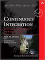
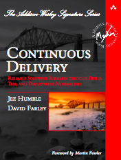
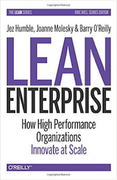
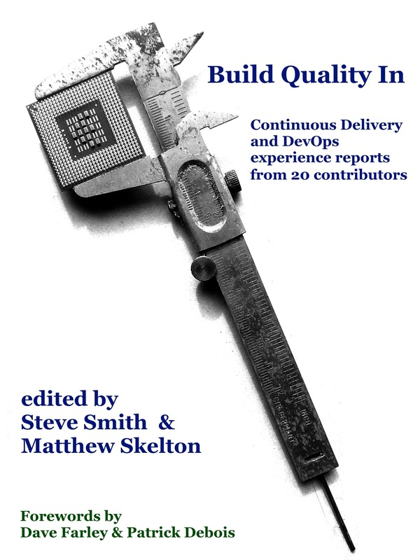
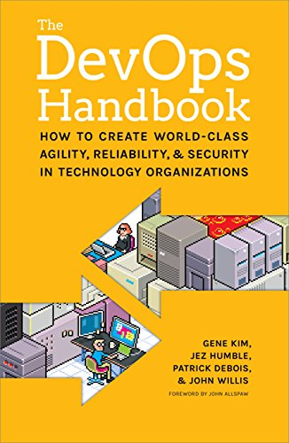
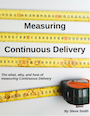
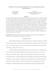

## Books promoting Trunk-Based Development

## Continuous Integration (June 29, 2007)

    
    

        <em>Continuous Integration: Improving Software Quality and Reducing Risk</em> 
        by Paul M. Duvall, Steve Matyas, Andrew Glover
         
        <a href="https://www.amazon.com/Continuous-Integration-Improving-Software-Reducing/dp/0321336380"><strong>Amazon </strong>(hardback, kindle)</a> 
    

     

## Continuous Delivery (July 27, 2010)

<em>Continuous Delivery: Reliable Software Releases through Build, Test, and Deployment Automation</em> 
by Jez Humble and Dave Farley 
<a href="http://amzn.to/1QBJM7k"><strong>Amazon</strong> (hardback, kindle)</a> 
<a href="http://bit.ly/jez-cd-ebook"><strong>InformIT</strong> (pdf, epub, mobi)</a> 
Translations: <a href="http://www.amazon.cn/gp/product/B005V9BB1M?tag=contindelive-20">中文</a> | <a href="http://www.amazon.co.jp/dp/4048707876?tag=contindelive-20">日本語</a> | <a href="http://acornpub.co.kr/book/continuous-delivery">한국말</a> | <a href="http://www.grupoa.com.br/livros/engenharia-de-software-e-metodos-ageis/entrega-continua/9788582601037">português</a>

## Lean Enterprise (January 3, 2015)

    
    

        <em>Lean Enterprise: How High Performance Organizations Innovate at Scale</em> 
        by Jez Humble, Joanne Molesky and Barry O'Reilly
         
        <a href="http://bit.ly/lean-enterprise-paper"><strong>Amazon </strong>(hardback, kindle)</a> 
        <a href="http://bit.ly/lean-enterprise-ebook"><strong>O'Reilly </strong>(pdf, epub, mobi)</a> 
        Translations: <a href="http://www.amazon.cn/dp/B01AS1ORWM?tag=contindelive-20">中文</a> | 
        <a href="https://www.amazon.co.jp/dp/4873117747?tag=contindelive-20">日本語</a> | 
        <a href="https://www.amazon.de/dp/396009020X?tag=contindelive-20">Deutsch</a> | 
        <a href="https://www.casadocodigo.com.br/products/livro-lean-enterprise">português</a>
    

     

## Build Quality In (February 27, 2015)

    
    

        <em>Build Quality In: Continuous Delivery and DevOps Experience Reports</em> 
        by Steve Smith and Matthew Skelton
         
        <a href="https://leanpub.com/buildqualityin"><strong>Leanpub </strong>(kindle)</a>
         
    

     

## DevOps Handbook (October 6, 2016)

    
    

        <em>The DevOps Handbook: How to Create World-Class Agility, Reliability, and Security in Technology Organizations</em> 
        by Gene Kim, Jez Humble, Patrick Debois, John Willis, John Allspaw
         
        <a href="https://www.amazon.com/dp/B01M9ASFQ3"><strong>Amazon </strong>(hardback, kindle)</a>
         
        <a href="http://shop.oreilly.com/product/9781942788003.do"><strong>O'Reilly </strong>(pdf, epub, mobi)</a>
         
    

     

## Measuring Continuous Delivery (2017)

    
    

        <em>Measuring Continuous Delivery: The what, why, and how of measuring Continuous Delivery</em> 
        by Steve Smith
         
        <a href="https://leanpub.com/measuringcontinuousdelivery"><strong>Leanpub </strong>(kindle)</a>
         
    

     

## Reports promoting Trunk-Based Development

## More Engineering, Less Dogma (Oct 18, 2013)

    
    

        <em>More Engineering, Less Dogma: The Path Toward Continuous Delivery Of Business Value</em> 
        by Kurt Bittner and Glenn O’Donnell
         
        <a href="https://www.forrester.com/report/More+Engineering+Less+Dogma+The+Path+Toward+Continuous+Delivery+Of+Business+Value/-/E-RES106521"><strong>Forrester Research - link</strong></a>
    

     

## The Role of Continuous Delivery in IT and Organisational Performance (Oct 27, 2015)

    
    

        <em>The Role of Continuous Delivery in IT and Organizational Performance</em> 
        by Nicole Forsgren and Jez Humble
         
        <a href="https://papers.ssrn.com/sol3/papers.cfm?abstract_id=2681909"><strong>Proceedings of the Western Decision Sciences Institute - link</strong></a>
    

     

## 2015 State of DevOps Report

    
    

        <em>A survey of thousands of software development professionals distilled into a report that determines
        practices for the highest achieving organizations</em> 
        &ldquo;It was gratifying, though unsurprising, to find that deployment pain was
        predicted by whether the key continuous delivery practices had been
        implemented: comprehensive test and deployment automation, the
        use of continuous integration including Trunk-Based Development, and
        version control of everything required to reproduce production environments&rdquo;
         by Puppet Labs
         
        <a href="https://puppet.com/resources/white-paper/2015-state-devops-report"><strong>Puppet's download form for the report</strong></a>
    

     

## 2016 State of DevOps Report

    
    

        <em>As their 2015 report, a survey of thousands of software development professionals distilled into a report that determines
        practices for the highest achieving organizations</em> 
        &ldquo;The idea that developers should work in small batches
                                                    off master or trunk rather than on long-lived feature
                                                    branches is still one of the most controversial ideas
                                                    in the Agile canon, despite the fact it is the norm in
                                                    high-performing organizations such as Google.
                                                    Indeed, many practitioners express surprise that this
                                                    practice is in fact implied by continuous integration,
                                                    but it is: The clue is in the word 'integration.'&rdquo;
         by Puppet Labs
         
        <a href="https://puppet.com/resources/white-paper/2016-state-of-devops-report"><strong>Puppet's download form for the report</strong></a>
    

     

