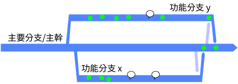
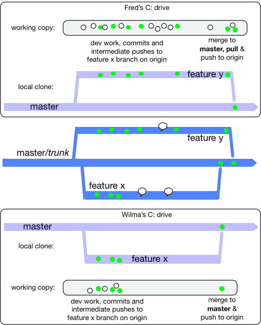

<!-- sdfsdfsd -->

This branching model was facilitated with the advent of very lightweight branching that came with Git and Mercurial
in the mid-2000's, though there is evidence that Google were effectively doing the same in their Monorepo for some years before.

Either as branching directly off main, or in a fork of the whole repository. These branches are destined to come
back as "pull requests" into the main/trunk.

<!-- wrweresd -->

With the Pull Request (and code review) advance, the cut-off point for team sizes that graduated from "direct to the trunk" to short lived feature branches moved lower.
While it was up to 100 before Git's lightweight branching, it is now up to 15 people. With 16 or more, the team is more
productive with short-lived feature branches, and corresponding CI daemons verifying those in advance of
commits landing in the trunk. 

One key rule is the length of life of the branch before it gets merged and deleted. Simply put, the branch
should only last a couple of days. Any longer than two
days, and there is a risk of the branch becoming a long-lived feature branch (the antithesis of trunk-based development).

<!-- sdwerfhfsdfsd -->

Another key rule is how many developers are allowed congregate on a short-lived feature branch. Another simple answer:
the developer count should stay at one (or two if pair-programming). These short-lived feature branches are not shared
within a team for general development activity. They may be shared for the purposes of code review, but that is entirely
different to writing production code and tests.

<!-- hrhykj -->

Sometimes the community calls these 'task' or 'topic' branches, instead of long-lived feature branch.

## Merge directionality

Short-lived feature branches are real branches and merge is a first class concept. In the run-up to completing work
on the short-lived feature branch, you will need to bring it up to date with main (trunk). That is an effective
merge whichever way you do it. Look at the branch at this moment, it may appear to be much younger than it was
before that operation. The changes have to now go back to main (trunk) in another merge operation. In GitHub, for
'pull requests' (or equivalent in other platforms), the user interface may handle that last merged back for you, and even
go as far as to delete the short-lived feature branch.

<!-- rteghfhj -->

To recap: merges to the short-lived feature branch are allowed to bring it closer to HEAD of main (trunk). Merges
to main (trunk) are allowed only as part of closing out the short-lived feature branch (and just before deleting it).

<!-- rteyyrt -->

## Two developers concurrently doing short-lived feature branches

Say two features are being worked on concurrently: features X and Y. Both will take a day to complete, and two developers are
working independently on them. Or four developers if pair-programming is that team's way.  The reality of the merge back to
main/trunk, before the deletion of the short-lived feature branch, is that a merge of changes **from** main/trunk
is often needed, before the merge **to** main/trunk.

Workflows include:

* Attempt to merge to main/trunk and if that's blocked do a merge/pull from main/trunk before attempting the push again.
* Do a speculative main/pull from main/trunk before attempting any push to main/trunk.

<!-- dwewrerg -->

The latter leaves no trace if there's nothing to merge in from the other branch.

### Workstations included

Really though Developers work on their own workstations. That is both for their "working copy" as well as their local Git clones complete with branches:

<!-- fhtytrerwe -->

The white dots are just general development work (save files from the IDE), and the green dot is the same but validated by a local  build that passes and a maybe a local commit.

While each developer works, they maintain a local clone of the main/trunk and their own short-lived feature branch only.
Indeed for a period of time, their short-lived feature branch may not yet exist in the shared origin repo.

<!-- qetgrth -->

## Personal preferences

At some point, the short-lived feature branch has to be brought right up to date with main (trunk) in a merge
operation before the result being merged back to trunk (and the branch deleted). There are a number of approaches
for this, and while teams may have a policy, some teams leave it to personal preference for the developer. 

### Git stash

Some people do `git stash` before `git pull` before `git stash pop`. There's a chance that when you `pop` your
working copy may be in a merge clash situation that has to be resolved before you progress. This way will always
result in your change being a single commit, at the HEAD of the branch (as Subversion would always do).

<!-- werregg -->

### Git rebase

Some people do `git rebase`. Refer to a well written Atlassian document on this  as well as one from ThoughtBot  that talks about `squash` too.  Even with this model,
you may encounter a merge clash, and have to resolve that locally before you can push the result anywhere, or do
further merges (to `main` hopefully).

<!-- wqwedsfsg -->

## Pitfalls

Working towards a pull request can sometimes make you look past the power of streaming a series of small commits into trunk for 
the benefit of all. High-throughput XP teams from the end of the 90's onward would stream tens of commits a day (per pair) 
into the trunk. Each commit would be an incremental step forward and able to go live as is, were the team to change plans
to do so.  A mistake in thinking for this way of working, is one pull-request for one Agile story/card (and no more). Getting 
out of that mind trap would be to practice (say) a pull-request for refactoring and see that integrated/merged into the trunk,
then a pull-request for a piece of new functionality (and integrated into trunk), then perhaps another refactoring (trunk 
integrated again). And for those three pull-requests they shared the same Story/card association, but perhaps had different 
short-lived branch names - each of which was deleted after merge/integration.

## Breaking the contract

If you merged the part-complete short-lived feature branches to anywhere else, then you have broken the
contract of trunk-based development. For short-lived feature branches, these are **not** allowed:

<!-- dgytjffdd -->

1. intermediate merges to main (trunk) - at least where the commit was not able to go live on its own 
2. merges (intermediate or not) to other people's short-lived feature branches
3. merges (intermediate or not) to any release branches (if you have them)
4. variations of #2 that are direct from/to the developers clone on their workstation
5. other developers joining you on your short-lived feature branches - at least who are not your pair-programming partner.

# Alternatives to short-lived feature branches

<!-- qweqwgtht -->

There is a more traditional alternative for smaller teams:
[Committing straight to the trunk](/committing-straight-to-the-trunk/). Many people still prefer this way of working, and if the whole team can do it without blowing up the build server, then great job team.

There is also the patch-review way of working that was outlined in Google's use of Mondrian (2006), and consequentially delivered for non-Google teams with open source tools Gerrit and Rietveld (2007/8). 

These two alternatives, as well as short-lived feature branches are compared in [Styles and Trade-offs](/styles/). 

# References elsewhere

<a id="showHideRefs" href="javascript:toggleRefs();">show references</a>

    <table style="border: 0; box-shadow: none">
        <tr>
            <td style="padding: 2px" valign="top">26 Apr, 2007, Blog Entry</td>
        </tr>
        <tr>
            <td style="border-top: 0px; padding: 2px" valign="top"><a href="https://paulhammant.com/blog/branch_by_abstraction.html">Introducing Branch By Abstraction</a></td>
        </tr>
    </table>

