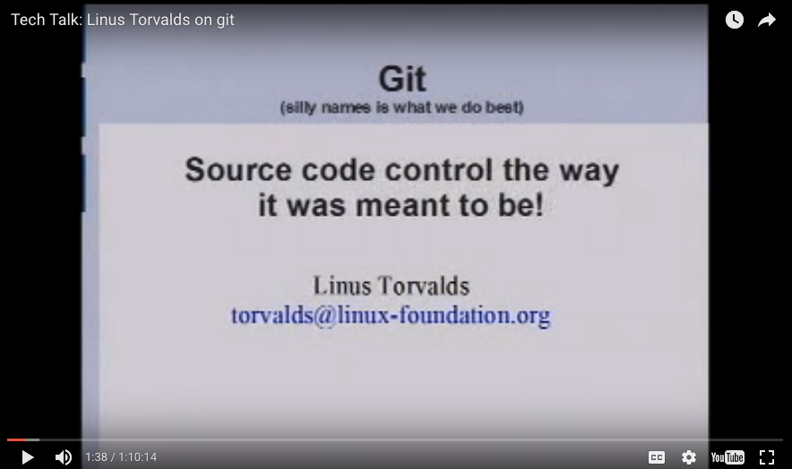

## Git and Mercurial

See Git's website and Mercurial's website

Git and Mercurial have been popular DVCS technologies for many years. Portals like GitHub make Git, in particular, the default 
choice for SCM/VCS/source-control. While the Linux Kernel is maintained with Git, and definitely takes advantage 
of the D-Distributed aspect of the DVCS of Git (in that many divergent versions of kernel can exist over 
long periods of time), most enterprises are still going to count a single repository as the principal one, and within 
that a single branch as the long-term "most valuable" code line.

It is perfectly possible to do Trunk-Based Development in a Git repository. By convention 'main' is the long term 
most valuable branch, and once cloned to your local workstation, the repository gains a nickname of 'origin'.

### Forks

An effective Trunk-Based Development strategy, for Git, depends on the developer maintaining a fork of the origin 
(and of 'main' within), and Pull-Requests being the place that ready to merge commits are code reviewed, **before** being 
consumed back into `origin:main`. Other branching models use the same Pull-Request process for 
code-reviews too - it is the normal way of working with Git since GitHub rolled out the feature.

### Size Limits

Historically, Git and Mercurial were not great at maintaining a zipped history size greater that 1GB. Many 
teams have reported that they have a repository size larger than that, so opinions differ. One way that you can reach 
that 1GB ceiling quickly is with larger binaries. As Git keeps history in the zipped repository, even a single larger 
binary that changes frequently can push the total use above 1GB.

With the likes of correctly configured Git-LFS extension to Git, though, the 1GB limit can be avoided or delayed 
many years.

Other ways to limit larger clone sizes in git repos include recommending/specifying a partial cloning date horizon 
with the "--shallow-since" parameter, or using git's more recent Partial-Clone features, supported in GitLab for 
example, to get the git commit history without getting all the blobs, and instead having the blobs download transparently 
on-demand/as-needed.

Git also has Submodules and 
Subtrees to allow large 
federations of modules, within one cloneable set.  For their 
 Android initiative, Google made Git-repo too.

### Root level branches

It'll be clear later why we mention this, but Git and Mercurial maintain branches from the root folder of the 
checkout clone, and maintains a single permission for a user in respect of read and/or write on the branch and/or repository.

### Future development

There is a suggestion that Mercurial is receiving contributions that will allow it to push into the very repository
territory the likes of Google needs.

Git and Mercurial don't have branch or directory permissions, but some of the platforms that bundle them, add 
branch permissions.

### Linus Torvalds presenting Git to Googlers

Back in 2007, Linus Torvalds presented his Bitkeeper inspired Git to Googlers in their Mountain View office:
 

<iframe src="//www.youtube.com/embed/4XpnKHJAok8" style="position: absolute; top: 0; left: 0; width: 100%; height: 100%;" allowfullscreen frameborder="0"></iframe>

 
<!-- print  print -->
<!-- print   print -->
<!-- print <a href="https://youtu.be/4XpnKHJAok8">Video Available at https://youtu.be/4XpnKHJAok8</a> print --> 
 
He had started making it two years before, and it is now the #1
VCS choice. Google had been running their Monorepo style Trunk for a few years at this point, without regret. Some
Googlers would later extend their Perforce (see below) setup to allow Git operation of local branches on
developer workstations.

### Platform Software Choices

* GitHub  - Git, cloud 
* GitHub Enterprise  - Git in GitHub's on-premises edition
* GitLab  - Git, cloud and on-premises install
* Atlassian's Bitbucket server - Git
* RhodeCode  - Git, Mercurial and Subversion
* Assembla  - Git, Mercurial, Perforce and Subversion
* Various Collabnet products and services for Git
* Microsoft's Visual Studio Team Services - Git, cloud
* Microsoft's Team Foundation Server - Git in Microsoft's on-premises edition

## Perforce

Perforce's website

### Vanilla Perforce

Perforce is a closed-source, industrial strength VCS. Pixar stores everything needed to make a movie in it, and Adidas 
store all their designs in it. Until 2012, Google had their Trunk and many tens of terabytes of history in it.
They moved off it to an in-house solution as they outgrew it. Perforce is peculiar in that its 'p4d' (a single server-side 
executable binary file) is the whole server and does not need to be installed - just executed.

Perforce is the last VCS technology that ordinarily maintains the read-only bit on the developer workstation. You 
definitely need a plugin for your IDE to handle the wire operations with the server, so you are not confronted with the
fact that source files are read-only. Because the Perforce (p4) client having to involve the server for the flipping of
read-only bits in respect of editing source files, it requires a permanent connection to the server. What that 
facilitates is the speed of operation for very large sets of files on the client. The Perforce server already knows what 
files need to have updated in your working copy, ahead of you doing 'p4 sync' operation. It negates the need for a 
directory traversal looking for locally changed files, and it means the sync operation can be limited to a second or two.

Historically Perforce was not able to **locally** show the history of the files within it. It needed that server 
connection again for history operations. A number of DVCS capabilities in newer versions of Perforce (see below) allow
local history now, though.

Perforce allows branches to be set up at any sub-directory, not just the root one. It also allows read and/or write
permissions to be specified at any directory (or branch) within large and small source trees.

#### No Code Review

Perforce does not have code-review features integrated into its traditional server daemon. By customizing a modified Gitlab 
called GitSwarm 'side install', Perforce now has a code review capability. It also has it with an alternate side-install 
called just Swarm (a slightly older product), that does not offer the Git capability of GitSwarm, but does add in much
of the team-ware features like code review.

### Git Fusion

There's a VM appliance from the Perforce people, that can sit in your infrastructure and mediate between the vanilla Perforce
server, and your wish to use a pure Git workflow on your development workstation.

With a Git Fusion clone from a Perforce repository, and client spec was specified, you get the subsetted 
representation of the source tree, complete with history. That's a neat feature. Things checked out through Git Fusion
also are not encumbered by the read-only bit feature.

GitSwarm kinda replaces this.

### p4-git and p4-dvcs

P4-git is very similar to the Git Fusion technology but is not made by the Perforce people themselves. It also does not 
require the launching of second server appliance (as Git Fusion does).

In 2015, the perforce technologies were extended to include custom DVCS features. All the features of p4-git but without 
the Git compatibility.

As for Git Fusion, things checked out through p4-git and p4-dvcs are not encumbered by the read-only bit control of p4d.

## Subversion

Subversion's website

Subversion (Svn) has been in development for 16 years and was a sorely needed open-source replacement for CVS. It chases some of the
features of Perforce but is developed quite slowly. Nobody has pushed Subversion to the Perforce usage levels, but 
that is claimed as a possibility.

Subversion, like Perforce, has read and write permissions down to the directory and branch.

Interestingly there is a "Subversion vs Git" website which attempts to counter
some widely held community beliefs about Subversion and how it stacks up to Git.

Note also that the Subversion team themselves, do not do Trunk-Based Development, despite Subversion have default root directories 
of 'trunk', 'tags' and 'branches' for newly-created repositories.

### No Code Review

Note that Subversion has no local branching capability, and to get code review you need to install third-party servers 
along side it. Or, a better choice, use a platform that integrates code review like those below.

### Git-Svn

There is an extension to Git that allows it to deal with a Subversion backend. A Git-subversion clone has all the 
local history, local-branching possibilities of Git. The local branching possibilities afforded by this 
mode of operation are very handy, and it should work easily with whatever Svn hosting platform you installed.

Note: That clone from subversion can be many tens of times slower, 
than the equivalent clone from Git, because it is recreating the zipped Git history on the client-side as in
uses the classic Subversion wire protocol, which is more chatty. Indeed the initial clone of years of commits for a 
reasonably sized team can take many hours. 

### Platform Software Choices

* RhodeCode - installable on-premises
* Various Collabnet products and services.
* ProjectLocker - cloud
* Deveo - cloud
* RiouxSvn - cloud
* SilkSvn - cloud
* Assembla - cloud and installable on-premises
* XP-dev - cloud
* Codeplex - cloud

## Team Foundation Server - TFS

TFS's website

Microsoft launched TFS in the mid-2000's with a **custom VCS technology** "TFVC". It is said that they have an internal 
'SourceDepot' tool that is a special version of Perforce compiled for them in the nineties, and that TFS reflects some 
of the ways of working of that technology. It has grown to be a multifaceted server platform. Perhaps even a 
one-stop shop for the whole enterprise's needs for application lifecycle management.  More recently with TFS, 
Microsoft encouraged a use of Git within it, rather than then proprietary VCS they initially developed.

TFS is perfectly compatible with a Trunk-Based Development usage.

Note: Microsoft are donating back to the Git community with a Git Virtual File System, which allows some Monorepo 
usage for Git.

## PlasticSCM

Plastic's website

PlasticSCM is a modern DVCS like Git and Mercurial, but closed-source. It is compatible with Trunk-Based Development and quite 
self-contained (has integrated code review, etc). Plastic is very good with bigger binaries and comes with an 
intuitive "Branch Explorer" to see the evolution of branches, view diffs, execute merges, etc. For sizes of individual
repositories, multiple terabytes is not unheard of. A least for some of the games-industry customers.
 
It is also the first modern VCS to have semantic merge - it understands 
select programming languages and the refactorings developers perform on them. For example "move method", where that
method is 50 lines long, is not 50 lines added and 50 deleted in one commit, it is a much more *exact* and terse diff
representation. 

Plastic even calmly handles a situation where one developer moves a method within a source, and another simultaneously 
changes the contents of the method in its former location. Plastic does not consider that a clash at all, and just does 
the merge quietly - the method moves and is changed in its new location.

